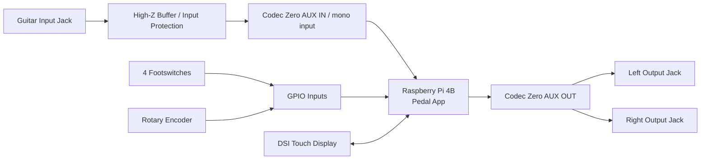
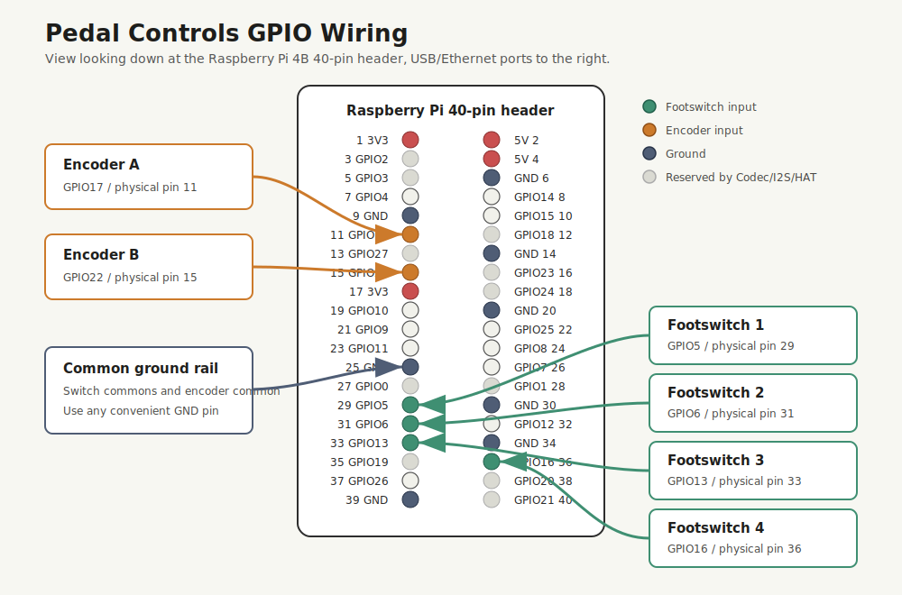
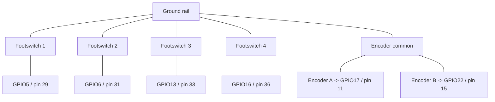
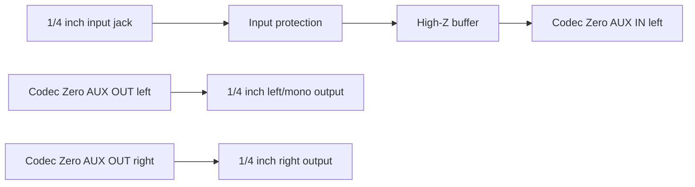

# Hardware Assembly Guide

This document captures the first physical pedal target:

- Raspberry Pi 4B, 1GB RAM
- Raspberry Pi Codec Zero audio HAT
- Raspberry Pi DSI touch display
- Four momentary footswitches
- One rotary encoder for master output volume
- Mono guitar input, stereo output

## Assumptions

- The display is connected through the Raspberry Pi `DISPLAY` / DSI connector.
- The Codec Zero is connected to the 40-pin GPIO header.
- Controls are read through Linux input drivers: `gpio-keys` for footswitches and `rotary-encoder` for the encoder.
- Footswitches and encoder contacts connect GPIO pins to ground. The Pi uses internal pull-ups.
- All GPIO wiring is 3.3V logic only.
- Guitar input should be buffered before the Codec Zero input. Passive guitar pickups should not be connected directly to a low-impedance line input if tone and level matter.

If the display is not a DSI display, redo the pin table before wiring.

## System Diagram



## Reserved Pins

Do not use these GPIOs for pedal controls:

| GPIO | Physical pin | Reason |
| ---: | ---: | --- |
| GPIO0 | 27 | HAT ID EEPROM bus |
| GPIO1 | 28 | HAT ID EEPROM bus |
| GPIO2 | 3 | I2C SDA |
| GPIO3 | 5 | I2C SCL |
| GPIO18 | 12 | I2S bit clock / `PCM_CLK` |
| GPIO19 | 35 | I2S word select / `PCM_FS` |
| GPIO20 | 38 | I2S input / `PCM_DIN` |
| GPIO21 | 40 | I2S output / `PCM_DOUT` |
| GPIO23 | 16 | Codec Zero green LED |
| GPIO24 | 18 | Codec Zero red LED |
| GPIO27 | 13 | Codec Zero tactile button |

The Codec Zero is an I2S HAT. Raspberry Pi 4 and earlier expose I2S on GPIO18, GPIO19, GPIO20, and GPIO21.

## Proposed Control Pin Assignment

| Function | GPIO | Physical pin | Wiring |
| --- | ---: | ---: | --- |
| Footswitch 1 / preset slot 1 | GPIO5 | 29 | Switch to GND |
| Footswitch 2 / preset slot 2 | GPIO6 | 31 | Switch to GND |
| Footswitch 3 / preset slot 3 | GPIO13 | 33 | Switch to GND |
| Footswitch 4 / preset slot 4 | GPIO16 | 36 | Switch to GND |
| Encoder A | GPIO17 | 11 | Encoder A to GPIO, common to GND |
| Encoder B | GPIO22 | 15 | Encoder B to GPIO, common to GND |

Use any convenient ground pins for the switch common rail. Good choices are physical pins `9`, `14`, `20`, `25`, `30`, `34`, or `39`.



## Header Map

View looking down at the Raspberry Pi GPIO header, USB/Ethernet ports to the right:

```text
 3V3  (1) (2)  5V             display power if used
 GPIO2(3) (4)  5V             display power alternative
 GPIO3(5) (6)  GND            display ground if used
 GPIO4(7) (8)  GPIO14
 GND  (9) (10) GPIO15
 GPIO17(11)(12) GPIO18        encoder A / I2S clock reserved
 GPIO27(13)(14) GND           Codec Zero button / ground
 GPIO22(15)(16) GPIO23        encoder B / Codec Zero LED
 3V3  (17)(18) GPIO24         Codec Zero LED
 GPIO10(19)(20) GND
 GPIO9 (21)(22) GPIO25
 GPIO11(23)(24) GPIO8
 GND  (25)(26) GPIO7
 GPIO0(27)(28) GPIO1          HAT ID EEPROM reserved
 GPIO5(29)(30) GND            footswitch 1
 GPIO6(31)(32) GPIO12         footswitch 2
 GPIO13(33)(34) GND           footswitch 3
 GPIO19(35)(36) GPIO16        I2S frame reserved / footswitch 4
 GPIO26(37)(38) GPIO20        free / I2S input reserved
 GND  (39)(40) GPIO21         ground / I2S output reserved
```

## Control Wiring



Notes:

- Configure all switch GPIOs with pull-ups.
- Pressed state is active-low.
- Use normally-open momentary footswitches.
- Add hardware debounce only if software debounce is not enough.
- Use shielded cable or twisted pair for long footswitch runs inside the enclosure.

## Audio Wiring



Audio notes:

- Treat Codec Zero AUX input as line-level unless measurements prove otherwise.
- Put a high-impedance guitar buffer before the codec input.
- Keep audio wiring away from display and GPIO wiring.
- Tie enclosure/shielding deliberately; avoid multiple noisy ground paths.
- Start testing at low output volume.

## Display Wiring

For a Raspberry Pi DSI display:

1. Power off the Pi.
2. Connect the FFC ribbon to the display.
3. Connect the other end to the Raspberry Pi `DISPLAY` connector.
4. For Raspberry Pi 4B and earlier, the ribbon contacts face the Ethernet/USB ports.
5. Power the display from the Pi 5V/GND pins only if the power budget and physical stacking allow it.

If the Codec Zero HAT occupies the header, use one of these:

- A stacking header with safe access to 5V and GND.
- Separate display power, if the display supports it.
- A small internal 5V distribution board feeding Pi/display according to each device's power rules.

Do not connect both GPIO power and a separate display power input unless the display documentation explicitly allows it.

## Physical Assembly Order

1. Mount the Raspberry Pi to the display or enclosure standoffs.
2. Connect the DSI ribbon before installing tight enclosure parts.
3. Install the Codec Zero on the 40-pin header or stacking header.
4. Wire the four footswitches to their GPIO pins and the ground rail.
5. Wire the encoder A/B pins and common ground.
6. Wire audio jacks to the buffer/interface board and Codec Zero AUX pins.
7. Inspect continuity with a multimeter before first power.
8. Power up with no guitar, no amplifier, and volume low.
9. Verify Linux sees the Codec Zero audio device.
10. Verify each footswitch and encoder event before running the realtime pedal app.

## First Power Checklist

- No loose strands or exposed wire touching the Pi or Codec Zero.
- Display ribbon fully seated and straight.
- Codec Zero aligned with pin 1 and seated on all 40 pins.
- Footswitches short GPIO to ground only, never to 5V.
- Encoder common goes to ground.
- 5V supply is sized for Pi + display + Codec Zero.
- Audio outputs are connected to a safe test amp or interface input at low level.

## Linux Device Tree Sketch

The hardware controls plan uses kernel input devices. A later Buildroot task should add overlays equivalent to:

```dts
gpio-keys {
    compatible = "gpio-keys";

    footswitch_1 {
        label = "preset-1";
        linux,code = <KEY_F1>;
        gpios = <&gpio 5 GPIO_ACTIVE_LOW>;
        debounce-interval = <20>;
    };

    footswitch_2 {
        label = "preset-2";
        linux,code = <KEY_F2>;
        gpios = <&gpio 6 GPIO_ACTIVE_LOW>;
        debounce-interval = <20>;
    };

    footswitch_3 {
        label = "preset-3";
        linux,code = <KEY_F3>;
        gpios = <&gpio 13 GPIO_ACTIVE_LOW>;
        debounce-interval = <20>;
    };

    footswitch_4 {
        label = "preset-4";
        linux,code = <KEY_F4>;
        gpios = <&gpio 16 GPIO_ACTIVE_LOW>;
        debounce-interval = <20>;
    };
};

rotary {
    compatible = "rotary-encoder";
    gpios = <&gpio 17 GPIO_ACTIVE_LOW>, <&gpio 22 GPIO_ACTIVE_LOW>;
    linux,axis = <REL_X>;
    rotary-encoder,relative-axis;
};
```

This is a sketch, not a ready `.dtbo` file. The compiled overlay is owned by the Buildroot plan (`board/ardor-pedal/ardor-controls.dts`).

The keycodes are `KEY_F1`..`KEY_F4` on purpose: they must match what `LinuxInput.cpp` listens for (see the Keycode Contract section in `docs/superpowers/plans/2026-07-08-hardware-controls-integration.md`). Do not change them here without changing the reader.

## Validation

Run these checks on the Pi:

```sh
aplay -l
arecord -l
cat /proc/asound/cards
```

Check controls:

```sh
cat /proc/bus/input/devices
evtest /dev/input/eventX
```

Check the app:

```sh
/etc/init.d/S99ardor-pedal restart
tail -f /var/log/messages
```

Pass criteria:

- Codec Zero appears as an ALSA card.
- Display turns on and shows the UI.
- Each footswitch produces one press event.
- Encoder produces relative turn events in both directions.
- Guitar input produces stereo output.
- No ALSA xruns during a 10 minute test at `48000 Hz`, block size `64`, IR samples `8192`.
- Thermal: with the enclosure closed, record `vcgencmd measure_temp` before and after the 10 minute soak, and `vcgencmd get_throttled` must stay `0x0`. A sustained near-loaded core in a closed pedal enclosure will hit the Pi 4's 80 °C soft throttle, and throttling at a 1.33 ms budget means audible dropouts — catch it on the bench, not on stage.

## References

- [Raspberry Pi Codec Zero documentation](https://www.raspberrypi.com/documentation/accessories/audio.html#raspberry-pi-codec-zero)
- [Raspberry Pi Codec Zero product brief](https://pip.raspberrypi.com/documents/RP-008135-DS-codec-zero-phat-product-brief.pdf)
- [Raspberry Pi I2S peripherals whitepaper](https://pip-assets.raspberrypi.com/categories/1259-audio-camera-and-display/documents/RP-009699-WP-1-Using%20the%20I2S%20peripherals%20on%20Raspberry%20Pi%20SBCs.pdf)
- [Raspberry Pi 4 hardware documentation](https://www.raspberrypi.com/documentation/computers/raspberry-pi.html#raspberry-pi-4-model-b)
- [Raspberry Pi Touch Display documentation](https://www.raspberrypi.com/documentation/accessories/display.html)
- [Raspberry Pi Touch Display 2 documentation](https://www.raspberrypi.com/documentation/accessories/touch-display-2.html)
