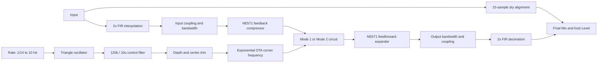

# PH-2 Super Phaser model and review

The `phaser_ph2` effect implements both original PH-2 signal routings in a
dedicated `Ph2Mode`. The generic `phaser` algorithm and its saved stage selections
are unchanged. This is a nonlinear, circuit-informed reduced model. It is not a
transistor-level netlist simulation or a measured match to an individual pedal.

## Reference circuit

The reference is the circuit diagram in the October 1984 first-edition
[BOSS PH-2 service notes](https://www.synfo.nl/servicemanuals/Boss/PH-2_SERVICE_NOTES.pdf),
also reproduced in
[Electric Druid's schematic](https://electricdruid.net/wp-content/uploads/2025/06/BossPH-2SuperPhaserSchematic.pdf).
[The routing diagram](https://electricdruid.net/wp-content/uploads/2025/06/Boss-PH-2-Modes-Diagram.svg)
helps identify the mode-switch connections. The
[ON Semiconductor NE570 datasheet](https://www.onsemi.com/download/data-sheet/pdf/ne570-d.pdf)
describes the rectifier and gain-cell behavior; BOSS lists NE570 as a compatible
NE571 replacement. The
[AS3109 datasheet](https://www.alfatriode.lv/eng/sc/AS3109.pdf)
supports the exponential-control / OTA structure, but clone specifications do
not establish the behavior of every original IR3109.

The service notes also contain a noise-reduction revision effective at serial
497100. That revision changes several resonance and phase-mixer resistors.
This implementation deliberately uses the original circuit throughout. In
particular, original R68 is **10k**, not 6.8k or 5.6k. Mixing revision values was
an error in the initial topology-only implementation and is corrected here.

## Audio and control paths



**Mode 1:** IC5B resonance mixer → C36 coupling → four IC7 swept stages →
C20 coupling → four IC4 swept stages → C22 coupling → two IC3 fixed stages.
The end of the ten-stage chain returns to IC5B through the Resonance pot. IC5A
mixes the phase signal with the compressed dry reference.

**Mode 2:** IC5B and the six IC4/IC3 stages form the first phaser and IC5A its
phase mixer. That mixed output becomes the input to IC10A and the six IC7/IC6
stages. IC10A has a fixed feedback path and IC10B is the second phase mixer.
Turning Resonance to zero therefore does **not** remove the second block's Q.
Both blocks sweep together in the original mono configuration.

| Circuit element | Implemented behavior |
| --- | --- |
| IC4, IC7; 470p, 68k, 560Ω networks | Eight swept OTA stages with differential-pair saturation |
| IC3, IC6; 5.6k / 10n | Fixed allpass corners at about 2.842 kHz |
| IC5B; R77/C44 = 4.7k / 1n | Frequency-dependent feedback compensation |
| IC10A; R64/C34 = 4.7k / 1n | Fixed compensated feedback with 0.817 DC loop gain |
| R89/R90/C53 = 6.8k / 4.7k / 4.7n | First resonance mixer's return divider and lowpass |
| R66/R69/C33 = 6.8k / 4.7k / 2.7n | Second resonance mixer's return divider and lowpass |
| VR1 = 10k, R4 = 4.7k | First loop's maximum feedback fraction 10/14.7 ≈ 0.6803 |
| IC5A | Dry coefficient `(4.7/26.7)*(1+4.7/18)`, wet coefficient `−4.7/18` |
| IC10B | Dry coefficient `(4.7/16.7)*(1+4.7/10)`, wet coefficient `−4.7/10` |
| C16, C17 = 4.7u | Independent 47 ms full-wave rectifier envelopes |
| C1/R6, C4/R5 | Two input coupling highpasses |
| C20/C36, C22/C29 | Reduced loaded coupling highpasses in the phase paths |
| C8/R12, C7/R91 | Reduced compressor and output bandwidth limits |
| C6/R7 | Output coupling highpass |

Mixer gains remain circuit-derived; they are not individually normalized to
50/50. This matters when the expander follows the two serial mixers. The resonance
mixers invert the dry input and feed the phase return to their non-inverting
inputs. Their return divider gives a 0.817 low-frequency gain before the first
loop's pot. The maximum original first-loop gain is therefore about 0.556, and
the fixed second-loop gain is about 0.817. Treating the second loop as unity
after the divider, or swapping the mixer inputs, produces the wrong resonances
and excessive output gain; both errors were caught in this review.

## Numerical method

Each capacitor uses a trapezoidal companion state. With `g = ω/(2 fs)`, a
linear lowpass evaluates as `lp = (state + g*x)/(1+g)` and commits
`state = 2*lp - state_old`. An allpass returns `x - 2*lp`. For swept stages,
the lowpass instead solves

`lp = state + g*S*tanh((x-lp)/S)`.

The summing divider and nominal thermal voltage give
`S = 25.85mV*(68k + 2*560Ω)/560Ω`, about 3.19 V. A bounded rational tanh
approximation and its analytical derivative are used consistently. Local
Newton iterations solve the OTA stage; linear fixed stages need no iteration.
The approximation is deterministic and symmetric: no random component
mismatch or noise is injected.

The complete resonance loop is solved in the **current sample**. Trial chain
evaluations do not advance any capacitor. The outer Newton solve includes the
allpass derivatives, input coupling, compensated feedback pole, return-divider pole, and mixer
headroom curve. Capacitors commit only after accepting the root. This avoids
the extra sample delay that would otherwise shift the resonances. Iteration
counts are bounded, root residuals are observable in validation, and tiny
states are flushed to prevent denormal tails.

The nonlinear core runs at 96 kHz. A fixed-size 31-tap halfband FIR pair
interpolates and decimates around the **whole** circuit, including gain cells
and feedback. Even-phase decimation produces exactly 15 host samples of
latency. The internal dry blend uses the same delay, and the host reports it
for scene-bypass alignment. There are no allocations in `Process` or `Prepare`.

The compressor rectifies its own output. Its instantaneous output magnitude
solves the positive quadratic implied by the smoothed envelope and inverse
gain. The expander rectifies its input and multiplies the audio by that
independent envelope. Compressor scaling uses the 10k/20k internal resistors,
140uA bias current and 47k input resistor. Expander scaling includes the
external 22k gain-cell resistor and the original output amplifier's 47k/10k
gain. A small rectifier floor keeps silence finite without adding noise.

## Controls, reset and automation

The Rate endpoints match the service-note periods of 14 s and 100 ms. The
normalized host control uses a square-law mapping between those endpoints;
the original 250kC pot's precise taper has not been measured.

The CV filter uses the actual 120k/10u time constant, 1.2 s. Its attenuation
narrows the fast sweep and rounds the triangle before the exponential
frequency mapping. All eight OTA stages use one corner per channel. Fixed
stages do not follow Depth or Tone.

Tone is an Ardor centre-trim extension: 250 Hz to 4 kHz with 1 kHz at the
middle. Depth allows up to six octaves **before** CV-filter attenuation; the
absolute CV-to-frequency trim and maximum excursion are calibration choices,
not a measured physical pedal's transfer. Depth zero freezes the corner,
whereas the service notes describe a little residual modulation at minimum
on the hardware. Keeping a truly stationary setting is an intentional host
extension useful for validation and sound design.

Stereo adds up to 180° of LFO offset and defaults to zero. Polarity defaults to
Original; Inverted reverses only the user-controlled first loop. Neither
extension alters the second block's fixed resonance. Mix blends the completed
pedal output with latency-aligned input; full Mix retains both internal phase
mixers. Host Level remains the final gain control.

Continuous centre, depth, resonance and stereo changes slew over about 10 ms.
Routing changes crossfade over 20 ms with both paths running. A previously
inactive routing starts with cleared capacitor histories, avoiding stale-tail
reintroduction. Reversing a crossfade mid-transition preserves both live
histories. Reset clears the oscillator, CV, both routings, both envelopes,
resamplers and alignment delay. Identical mono channels share one calculation;
their state is copied, and the shortcut is disabled after any stereo history
diverges. Offline rendering allows a conservative three-second ringing tail.

## Validation and review

`pedal-ph2-quality` checks the following against behavior, not snapshots:

- Twelve small-signal frequency-response cases: two modes, minimum/maximum
  first-loop resonance, and three probe frequencies. Expected responses are
  independently derived from circuit impedances with a bilinear s substitution,
  without the production lookup table or allpass helpers.
- NE571 compression/expansion slopes, compressor resistor scaling and the
  47 ms rectifier decay; exact silence at either gain cell.
- Rate-dependent sweep narrowing, complete reset, reported latency, delayed
  dry Mix and independent stereo channels.
- Five seconds of stereo overload up to ±4 V with changes to mode, polarity,
  trim, depth and rate; bounded output and feedback-root residuals.
- Ten seconds of silence after overload; no persistent DC or oscillation.
- FIR latency measured from its actual impulse, mode-switch continuity,
  preservation of diverged stereo histories, folded fifth-harmonic levels,
  and guitar output headroom at the tested settings.

`pedal-mod-effect-controls` covers catalog modes, audible resonance changes,
mono/stereo behavior, dry Mix and additional automation. Runtime-chain tests
check sample and block bypass alignment for PH-2. Existing modulation model,
catalog and automation checks remain applicable. Manager fixtures are generated
from the device formatter and checked for parity.

Run and render reproducible synthetic-guitar examples and settled-sine RMS
response curves with:

```sh
cmake -S . -B build-ci
cmake --build build-ci --target pedal-ph2-quality
./build-ci/pedal-ph2-quality
./build-ci/pedal-ph2-quality --render /tmp/ardor-ph2-review
```

The rendered curves include the compander and are level-dependent RMS gains,
not a linear transfer-function claim. WAV examples retain their actual levels.
The tool prints timing, output peak and solver residual diagnostics; timings
on a development workstation do not certify the target pedal's CPU budget.

The final release validation passed the PH-2 suite, modulation controls,
runtime-chain bypass checks, Daisy smoke/automation and both catalog checks.
The complete PH-2 suite also passed AddressSanitizer/UndefinedBehaviorSanitizer
with leak detection enabled, and the DSP source passed strict compiler warnings.
All 356 targeted manager catalog/display-parity tests passed. At the tested
5 kHz / 0.5 V input, folded fifth-harmonic levels were approximately −108 dBc
in Mode 1 and −84 dBc in Mode 2. The overload root residual stayed below
2e−5 V. Six-second mono guitar renders took approximately 0.42 s and 0.47 s
on this development host, with peaks 0.261 and 0.777 respectively at Resonance
70%, Depth 90%, normalized Rate 0.15. These are reproducible synthetic examples,
not comparisons against recordings of the pedal.

## Fidelity boundary

All principal signal blocks are represented, but this remains a reduced model.
Coupling-capacitor loads use nominal effective resistances, gain-cell
compensation uses a reduced bandwidth pole, and mixer/buffer headroom uses a
smooth nominal ±3 V curve. Device slew rate, unequal IR3109 buffers, transistor
offsets, supply sag, component tolerances, stochastic hiss and NE571 DC-servo
networks are not simulated individually. The complete multi-node NE571
compensation network and the exact oscillator/control-pot taper are not
netlist-solved. The later production revision is not offered as a second voicing.

Physical-pedal recordings are still required to calibrate the centre trim,
absolute sweep excursion, digital-units-to-volts scale, level recovery and
distortion knee. The model's circuit response and numerical stability can be
verified without those recordings; a claim of indistinguishability cannot.
