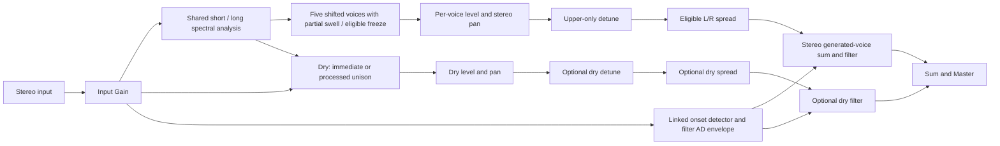

# POG3-inspired polyphonic octave block — implementation plan for Luna

Date: 2026-10-05. Repository inspected: `fb163c2a`, **including the current working-tree changes**. This is a design and implementation handoff, not an implementation or a claim that the proposed DSP has passed its gates.

Implementation started on 2026-10-06. See [implementation status and measured evidence](pog3-implementation-status.md) for the parameter contract, granular comparison harness, streaming spectral foundation, and remaining milestones.

**M3 implementation update:** the implemented bank additionally uses shared N=4096/H=512 analysis below 400 Hz because the ordinary low-chord gate failed with two windows. Its 200–300 Hz reconstruction crossover uses the existing output IFFTs. Renderer jobs now use the explicit one-hop staging correction below. Main delays are 24/48 ms; a low-note octave envelope measured about 60/72 ms with Focus off/on. Family/attack and freeze work must include all three representations. The status document records current quality, CPU/memory results, remaining resolution limits, and the live-relative-phase caution for stationary freeze. These are measured implementation adaptations, not EHX hardware specifications.

**M4 implementation update:** shared stereo families/residual partials now preserve old sustain while swelling new excitation, with low/long attack histories evaluated at each resolution's input timestamp. Processed unison uses resolved low partials when attack is active. Attack interpretation runs before staged render jobs, now completing at long age 251 and short age 112; N+H identity delay is unchanged. This first scorer requires directly supported fundamentals and keeps missing-fundamental material as residual partials. Four excitation epochs per partial have an explicit capacity fallback. See the status document for independence gates, host timing, memory, and remaining fidelity/admission limits. Filter AD remains the separate next milestone.

**M5 implementation update:** a separate playing-event detector and finite filter AD now drive stereo LP/BP/HP buses. Voice levels/pan precede eligible doubling and asymmetric Spread; dry stays separate through optional filtering and final Master. The LP-open extension, zero-depth/zero-delay endpoints, queued stationary-tap fades, reset and rapid automation are tested. Detector peak release follows a material decrease in 100 ms mean energy to suppress held-chord beating. Doubling blends from direct to a 50/50 direct/modulated-delay mix as depth rises; this is an Ardor voicing choice. Requested preparation allocation is now about 2.13 MiB, exceeding the initial 2 MiB goal; observed host timing also remains outside the 25%-of-period target. See the status document for evidence and pending device/listening/admission work. M6 expression routing is next; M7 freeze and M8 public integration remain incomplete.

**M6 DSP implementation update:** `Pog3Processor` now compiles immutable endpoints off the callback, publishes through the same 33 key/index targets, and resolves independent base/effective values every 48 samples. Off, generated-only Volume, normalized Crossfade, semitone Warp and Filter routing are implemented. Volume gain follows generated filtering and precedes final Master, leaving even fully processed dry unchanged. Exact scalar/snapshot endpoints and mode-specific endpoint formatting are available. At this checkpoint both unfinished freeze selections were rejected; M7 below replaces that temporary rejection. Public physical/MIDI/scene dispatch round-trips remain an M8 integration gate. See the status document for evidence, costs and remaining work.

**M7 DSP implementation update:** all seven modes now have audio behavior. Fixed stereo carrier snapshots retain all three analyses and current Attack gains; held synthesis advances separate oscillator phases through the existing staged IFFTs and low crossover. Gliss interpolates frequencies/magnitudes with bounded deterministic assignment, and full toe pauses a moving glide. Heel/reset/mode exit, startup capture, Reverse, dry eligibility and Focus switching are tested. The first implementation holds tonal peaks above 20 Hz, excluding DC/independent noise residual; a linked spectral-flux target proposer with 40 ms coalescing and 42.67 ms stabilization replaces the proposed family-onset path. Initial nonheel capture waits for a full low history and 96 ms of continuously audible partial history, including after prolonged silence. These are explicit adaptations requiring dense/real-DI calibration. Both 60-second sine/chord holds and moving-carrier checks pass; CPU/memory admission, listening, target endurance and M8 public integration remain open. See the status document for measured limits and reproduction commands.

**Admission optimization update:** compact capture/goal layouts, bounded region indices, a shared immutable interpolation table, renderer-owned inverse scratch and N+H renderer OLA rings reduce the all-mode prepared host allocation to 2,054,734 bytes (1.960 MiB), meeting the initial 2 MiB goal. Double oscillator/live phase precision, all three resolutions and partial/epoch capacities are retained. Direct interior interpolation and fixed sorted stereo/canonical Attack indexes reduce callback work while preserving original distances/ties; all 53 baseline raw renders are byte-identical. A numerically valid packed-real-FFT prototype regressed measured cost and was removed. The 25%-of-period CPU goal, dependable callback margin, target memory/endurance and public integration remain open; consult the status document for final validation and measurements. This update does not authorize a selectable catalog entry before admission.

**Further CPU refinement update:** previous complex-bin history now replaces separate phase/magnitude history, so phase is evaluated only for detected peaks while retaining the original frequency arithmetic. At a fully held endpoint, live generations/phase/low alignment stay warm while their zero-gain spectral contribution is skipped. A new independent live-reference release gate covers both renderer sizes, low analysis, unison and −24/+7/+24 intervals, including notes born during the hold. Forward contiguous interior traversal retains the 24-tap kernel and per-destination addition order, with wider host compiler vectorization. All-mode requested allocation is now 2,054,590 bytes (1.960 MiB); FFT sizes, staged deadlines and wet latency are unchanged. Final verification/cost evidence is recorded in the status document. CPU/target admission and M8 public integration remain open.

## 1. Objective and instructions to the implementing agent

Build one new effect, `mod/pog3`, displayed as **Poly Octave 3**, with six independently mixed and panned voices, expressive swells, a resonant envelope filter, upper-voice doubling, stereo spread, expression morphing, pitch warp, and spectral freeze. Put it in Ardor's existing modulation family so presets, expression assignments, MIDI parameter mappings, scenes, and the block browser use the established paths.

Treat the numbered milestones below as an execution order. Each milestone has an observable acceptance gate. Finish the DSP feasibility milestones before adding the public catalog entry. A playable five-shifter prototype is useful evidence, but is not the finished block.

Do not use subagents: the repository instructions permit them only when explicitly requested. The request for a plan **for Luna** does not authorize launching Luna or another agent. Do not deploy, rebuild tracked device binaries, regenerate the bundled device web UI, or change unrelated in-progress work as part of implementing the DSP unless that work is separately requested.

The tree is already substantially modified. Relevant modified files include `CMakeLists.txt`, both Daisy catalog/processor files, manager catalog/formatters/fixtures, runtime routing, UI files, and manager preset validation. Read their current contents again before editing. Preserve existing effect identifiers, descriptor indexes, defaults, and intentional changes. In particular, do not base patches on an assumed clean checkout or overwrite generated fixtures from an older catalog.

### Completion boundary

The intended completed block includes all seven proposed expression selections, including Off and both freeze behaviors. Milestones are implementation stages, not permission to silently omit difficult features. If a quality or device-performance gate fails, report the specific limitation and leave the feature incomplete; do not label a global swell as independent polyphonic attack or a repeating audio buffer as a stationary spectral freeze.

Hardware-pedal UI, analog electrical specifications, USB firmware management, EHXport interoperability, an extra Direct output, and MIDI keyboard synthesis are outside this audio-block implementation. Ardor already owns preset storage, bypass, expression calibration, and MIDI routing. No private bank of 100 presets belongs inside this processor. Optional starter sounds are ordinary Ardor presets or documented parameter recipes.

## 2. Reference and fidelity contract

I read all 24 PDF pages, including the filter-envelope diagrams and the expression interval chart. The product reference is the [official EHX POG3 manual, version 1.0](https://www.ehx.com/wp-content/uploads/2024/07/POG3_manual_web_v1.pdf). Printed page numbers below refer to the manual, not zero-based PDF indexes.

The relevant manual contract is compactly summarized here:

> Six voices: dry, −2, −1, fifth, +1, +2, with separate level/pan. Input gain is 0.5–3×. Attack reaches three seconds and is note-independent; dry routing is optional. Generated voices use a resonant LP/BP/HP filter with a triggered attack/decay sweep. Detune affects the upper octaves and optionally dry. Spread delays fifth/upper voices, optionally dry, but excludes suboctaves; its left/right maxima are 50/150 ms. Focus jointly changes both upper algorithms and permits their warp/freeze. Expression provides volume, control morphing, warp, filter, and two freeze modes. Volume leaves dry unchanged. Warp excludes dry. Dry freeze requires Dry Attack and Attack above 10%.

Sources: manual pp. 2–7, 13–20. This is a paraphrase, not extracted DSP code.

The manual does **not** disclose the internal pitch algorithm, complete processing order, filter pole count, cutoff range/taper, Q scaling, chorus modulation, spectral capture method, master-volume taper, or the exact mapping of Warp to every voice. Do not describe our choices for these as measured EHX behavior.

Use these evidence labels in implementation notes:

- **Required behavior:** the contract above and the edge cases listed in this plan.
- **Ardor design:** explicit numerical mappings, stereo-input extension, signal ordering, and algorithms specified below.
- **Calibration pending:** a physical-pedal comparison could change numerical voicing and ambiguous mappings; no pedal recording was supplied.

Our Focus implementation will be a short-window and a longer, more coherent spectral renderer, not a reconstruction of EHX's proprietary POG/Pitch Fork algorithms. Both upper voices switch together. The short path must have a lower measured wet onset delay; the focused path must improve difficult sustained/chord cases. Merely changing a label or forbidding controls on otherwise identical audio is insufficient.

Independent attack will use partial tracking and harmonic-group onset ownership. This is a carefully tested approximation to note separation, not a promise to separate coincident harmonics or two players at the same pitch. State this fidelity boundary in the final model documentation.

For the spectral renderer, consult the primary paper [Laroche and Dolson, *New phase-vocoder techniques for pitch-shifting, harmonizing and other exotic effects*](https://www.ee.columbia.edu/~dpwe/papers/LaroD99-pvoc.pdf). Its peak-region approach motivates keeping each partial's local phase relationships intact. Our onset grouping, freeze state machine, schedules, and parameter contracts are separate engineering decisions. Do not copy third-party sample code without checking its license.

## 3. Repository findings that determine the architecture

| Inspected area | What exists | Consequence for the new block |
| --- | --- | --- |
| `src/daisyfx/hosted/dsp/pitch_shifter.{h,cpp}` | Two Hann grains, waveform-similarity restart search, caller-owned history, fourth-order upward anti-aliasing, fast ratio updates | Reuse for the initial audible prototype and as a quality baseline. Do not assume five stereo copies are cheap or prove chord fidelity from a sine test. |
| `src/daisyfx/hosted/modes/whammy_mode.{h,cpp}` | Chromatic pitch glide, block-to-sample ratio ramps, per-channel processing, correct per-channel anti-alias retuning | Reuse control-domain reasoning, ratio conversion, and the principle of independent stereo state. Do not reuse its whole mode: it embeds incompatible preset and dry-mix behavior. |
| `src/daisyfx/hosted/modes/harmonizer_mode.{h,cpp}` | Two voices, per-channel state, chromatic conversion after a monophonic key/scale tracker | Reuse state organization and level/pan transition ideas. Do **not** reuse `PitchTracker`, note hysteresis, key selection, or diatonic interval logic in the signal-generation path. |
| `src/daisyfx/hosted/modes/poly_octave_mode.{h,cpp}` | Filter-bank octaves, mono generated signal, three shifted voices, broadband envelope-ratio swell, voice makeup trims | Useful sound/CPU reference. Its existing swell is global, its mix merges voices early, and it has neither fifth nor +2; it is not the complete new engine. |
| `src/daisyfx/hosted/dsp/octave_generator.h`, `band_shifter.h`, `multirate.h` | 48 bands; octave phase identities; 6× resampling to 8 kHz | Do not casually add a +2 phase power at 8 kHz: useful input content can alias after a 4× shift. Current frequency-coverage comments conflict; actual 48-band centers run approximately 60–1680 Hz. Leave existing audio unchanged. |
| `src/daisyfx/hosted/params/mod_param_*` | Nine fields with fixed descriptor/scene indexes | This block needs its own semantic parameter structure. Do not turn `p1` into a page selector or enlarge every legacy `ParamSet`. |
| `src/daisyfx/DaisyFxProcessor.cpp` | Nine atomic targets, fixed 48-frame preparation, mix/level smoothing, three processor kinds | Add a dedicated implementation kind before the ordinary `mod` branch; otherwise the factory and fixed target mapping reject/lose our controls. |
| `src/daisyfx/DaisyFxCatalog.{h,cpp}` | Arbitrary-length descriptor vector, but legacy mode/key formatting assumes standard fields | A custom descriptor fits. Route formatting/control specs to our parameter definitions before the legacy modulation range lookup. |
| `src/dsp/RealtimeFft.{h,cpp}` | Radix-2 FFT; allocation in `prepare`, none in `transform`; inverse scales by `1/N` | Reuse this implementation, not the offline FFT in `WavIo.cpp`. Extract its build ownership into a small shared dependency to avoid a DSP↔Daisy link cycle. |
| `src/preset/ScenePlan.cpp` | Numeric Daisy descriptor indexes become runtime scene targets; choices use stepped laws | Descriptor order is an ABI. New semantic keys work if the processor's index map matches exactly. Snapshot objects are structural, not numeric scene targets. |
| `src/dsp/RuntimeChain.cpp` | Daisy processing, cut bypass, scalar/block paths, reset, latency and tail use | Exercise both paths. Freeze must not survive a cut/re-enable as a stale surprise. Keep the existing modulation bypass capability. |
| `src/ui/ParameterControls.cpp` | Six controls per page, dynamic descriptor enumeration | All 33 numeric controls can use existing paging. Do not increase physical knob counts or repurpose hosted `NUM_PARAMS`. |
| Manager catalog/formatters/tests | Numeric Daisy controls; C++/TS parity fixtures; parameter count/order/default parity | Even booleans/enums must stay numeric normalized Daisy controls in the persisted schema. Group their presentation without breaking parity. |
| `services/managerd/internal/presets/presets.go` | Explicit WDW modulation-mode allowlist | Add `pog3` there; a serial-only happy-path test misses this rejection. |
| `apps/pedal-poc/main.cpp` | Existing expression/MIDI parameter dispatch calls `setDaisyParameter` | Bind expression to `expression_position`; use ordinary assignments, not a global EHX CC interception layer. |

Current `ModModeId` ends at `PhaserPh2 = 16`, `COUNT = 17`. **No new `ModModeId` is needed** for the dedicated kind proposed here. The public family remains `DaisyFxKind::Mod`. Do not increment a vendor enum or change obsolete physical-controller constants simply to match catalog size.

## 4. Chosen architecture and alternatives

### 4.1 Shipping architecture

Implement a dedicated `Pog3Processor` owned by `DaisyFxProcessor::Impl`. It has typed physical parameters, a normalized registry, six voice states, a shared spectral analysis per input channel, and two analysis resolutions:

- Long/coherent analysis: initially `N = 2048`, `H = 256`, 48 kHz. Always supplies −2, −1, and fifth; supplies both uppers when Focus is on; supplies an optional processed unison for Dry Attack/freeze.
- Short analysis: initially `N = 1024`, `H = 128`, 48 kHz. Supplies both fixed upper octaves when Focus is off.
- Both are causal streaming engines with preallocated rings and overlap-add buffers. These sizes are starting design constants, subject to the quality/CPU gates. They are not pedal specifications.
- Each analysis produces tracked spectral regions. Five pitch renderers reuse those regions with fixed ratios, Warp ratios, or held spectra. Voice level and pan remain separate until the final mix.
- Filter, detune, and spread run at the host rate after resynthesis.

Use shorter and longer windows within one well-tested spectral implementation rather than maintaining two unrelated new algorithms. Focus therefore reproduces the **functional choice and relative latency/quality tradeoff**, not the manufacturer's exact timbres. Keep this qualification in user-facing effect documentation.

### 4.2 Why five existing granular shifters are only milestone 1

They immediately supply −24, −12, +7, +12, and +24 semitones and continuous warp. However, ten channel instances synchronize restart searches, cannot capture a stationary spectrum, and do not implement note-independent attack. Fixed-ratio processing of a chord does not itself establish clean polyphony. Use them to produce a reference and measure the baseline, then implement the shipping spectral engine. Do not make an undocumented granular fallback permanent if it fails the final contract.

Do not rewrite the shared granular shifter during this feature unless a reproducible defect requires it. Its existing fractional restart and anti-alias fixes protect Whammy, Harmonizer, Shimmer, and Chorus Detune. Any necessary shared modification requires their existing regression suites.

### 4.3 Build ownership

Create `ardor_realtime_fft` from the existing `src/dsp/RealtimeFft.cpp`, with public include root `src` and C++20. Remove that source from the `ardor_dsp` object-library source list. Link the new small library from both `ardor_daisyfx` and `ardor_dsp`. Do not link `ardor_daisyfx` against `ardor_dsp`, which already depends on Daisy.

This is a build refactor only: preserve the FFT API, twiddle calculations, normalization, and convolver results. Reusing its vectors is safe only if **all** their sizes/capacities are fixed before processing. Add assertions that a transform workspace's size equals the prepared size; the current helper trusts the caller.

## 5. Persisted schema, indexes, mappings, and defaults

Use block type `mod`, mode string `pog3`, catalog ID `mod:pog3`, name `Poly Octave 3`, category `modulation`, and the existing modulation admission constraint. Search aliases may include `POG3`, `polyphonic octave`, `organ`, and `octave generator`. Do not convert existing `poly_octave` presets.

All descriptor fields below are persisted as finite numeric values in `[0,1]`. Resolve physical units in one C++ parameter module; mirror formatting/inverse input conversion in TypeScript. No generic host `mix`, `speed`, `tone`, `p1`, or `level` is added. This processor owns its voice mix and applies its own master exactly once.

**Freeze this descriptor order.** Future controls append; none of these indexes move.

| Index | Key | Label | Default u | Physical mapping / semantics |
| --- | --- | --- | --- | --- |
| 0 | `input_gain` | Input Gain | 0.20 | `0.5 + 2.5u` ×; default unity |
| 1 | `dry_level` | Dry | 1.00 | linear amplitude `u`; zero is exact silence |
| 2 | `down2_level` | −2 Oct | 0.00 | linear amplitude `u` after fixed voice calibration |
| 3 | `down1_level` | −1 Oct | 0.30 | same |
| 4 | `fifth_level` | +5th | 0.00 | same |
| 5 | `up1_level` | +1 Oct | 0.25 | same |
| 6 | `up2_level` | +2 Oct | 0.00 | same |
| 7 | `dry_pan` | Dry Pan | 0.50 | signed pan `p = 2u − 1` |
| 8 | `down2_pan` | −2 Pan | 0.50 | same |
| 9 | `down1_pan` | −1 Pan | 0.50 | same |
| 10 | `fifth_pan` | +5th Pan | 0.50 | same |
| 11 | `up1_pan` | +1 Pan | 0.50 | same |
| 12 | `up2_pan` | +2 Pan | 0.50 | same |
| 13 | `master_level` | Master | 0.50 | `2u` ×; unity at 0.5, exact mute at zero |
| 14 | `attack` | Attack | 0.00 | `3u²` seconds; u=0 explicitly disables swell |
| 15 | `dry_attack` | Dry Attack | 0.00 | numeric Off/On, snapped to 0/1 |
| 16 | `filter_frequency` | Filter | 1.00 | `40 × 500^u` Hz: 40 Hz–20 kHz, logarithmic |
| 17 | `filter_mode` | Filter Type | 0.00 | LP/BP/HP at normalized 0/0.5/1 |
| 18 | `filter_q` | Resonance | 0.00 | `0.70710678 × (8/0.70710678)^u` |
| 19 | `filter_env` | Envelope | 0.50 | signed excursion `6(2u−1)` octaves; center disables |
| 20 | `filter_attack` | Sweep Attack | 0.50 | `0.005 × 600^u` seconds: 5 ms–3 s |
| 21 | `filter_decay` | Sweep Decay | 0.50 | `0.020 × 150^u` seconds: 20 ms–3 s |
| 22 | `trigger_sensitivity` | Sensitivity | 0.50 | greater u means lower onset threshold; detector mapping in §8 |
| 23 | `dry_filter` | Dry Filter | 0.00 | numeric Off/On |
| 24 | `detune` | Detune | 0.00 | depth 0–1; 0 explicitly bypasses modulation |
| 25 | `spread` | Spread | 0.00 | left `50u` ms, right `150u` ms |
| 26 | `dry_detune` | Dry Detune / Spread | 0.00 | numeric Off/On; controls both dry doubling and dry spread eligibility |
| 27 | `focus` | Focus | 0.00 | numeric Off/On; joint upper renderer selection |
| 28 | `expression_mode` | Expression | 0.00 | Off, Volume, Crossfade, Warp, Filter, Freeze + Gliss, Freeze + Volume |
| 29 | `expression_position` | Pedal | 1.00 | normalized virtual position; ordinary Ardor expression/MIDI target |
| 30 | `expression_heel` | Heel | 0.00 | endpoint interpretation depends on selected mode |
| 31 | `expression_toe` | Toe | 1.00 | same |
| 32 | `expression_reverse` | Reverse | 0.00 | numeric Off/On |

Use nearest-choice decoding, not `floor(u × count)`: `index = clamp(floor(u × (count−1) + 0.5), 0, count−1)`. A binary tie chooses On. Expose canonical choices `i/(count−1)` consistently in the DSP, C++ UI, and TS. Avoid smoothing an enum through other selections.

Mappings not explicitly specified by the manual are Ardor choices. The filter has a practical LP-open bypass at `filter_frequency = 1`, zero envelope, and minimum Q; BP/HP never bypass merely because the frequency slider is high. Crossfade this LP-open transition rather than stepping. State this useful extension in the model documentation.

Keep linear voice faders and center-unity pan. Fix voice calibration trims after objective comparison; do not add signal-dependent normalization that causes pumping when another voice is enabled. Do not copy Poly Octave's measured makeup numbers into a different engine. The default mixture should measure within ±2 dB of unity bypass on the shared guitar phrase with no input clipping.

### 5.1 Additional structural data for Crossfade

`params` may also contain `crossfade_heel` and `crossfade_toe`, each an object of normalized scalar endpoint values. They are **not** descriptor controls and do not get scene indexes. Allowed keys are the continuous sound controls from indexes 0–14, 16, 18–22, 24–25. Exclude all toggles/enums and all expression configuration. Do not nest a full preset or a second expression assignment.

If a key is absent from both endpoint objects, it is not morphed and retains its ordinary base value. If present on only one side, resolve the other side to the configured base value. Compile the union into a fixed-size endpoint array and bit mask during configure. Reject recognized endpoint keys with nonnumeric/nonfinite values; clamp finite out-of-range endpoint values consistently with scalar parameters. Preserve unrecognized extra JSON data when round-tripping through editors, but do not use it as a DSP target.

Snapshot objects are immutable for the lifetime of a configured processor. Editing them rebuilds the block through the existing off-thread preparation/preset activation path. Do not assign maps or JSON on the audio thread. If a later live endpoint update is required, use the repository's safe publication/reclamation mechanism; independent atomics do not provide an indivisible multi-parameter snapshot.

## 6. Audio routing and output contracts

The manual does not expose a complete internal ordering. Adopt and document this order:



Keep generated and dry sums distinct through the final filter/mix. Two stereo filter pairs may share coefficients but have independent state, so `mixed = master × (generated + dry)` and `wet = master × generated` are both available. Because the proposed filter is linear, splitting dry/generated filtering this way preserves the chosen filter response. Do not introduce a nonlinear shared bus processor without revisiting this decomposition.

Apply pan **before** the stereo space lines. Otherwise our stereo folding pan law would mix the 150 ms right delay into a hard-left output and invalidate the stated 50 ms left maximum. Each output-side space line then retains its own delay relationship. Keep histories across level/pan moves and drain their old contributions naturally; an already delayed tail can briefly remain on its former side after repanning.

`DaisyFxProcessor::processFrame` delegates directly to the new processor. Do not run ordinary modulation mix/level smoothing or `OwnsDryMix` afterward. Never add host dry on top of the block's already mixed dry. A processed dry voice remains the dry component for this API; document this convention. Audit actual WDW consumers rather than assuming `.wet` is used everywhere: the current RuntimeChain tail path uses `.mixed`.

Input Gain affects the six signal paths and the onset detector. Master is last. Bypassing the whole block returns the original host input, without Input Gain or Master. An EHX-style buffered Direct jack is not another output of this two-channel API.

### 6.1 Stereo-input adaptation and pan law

The reference pedal accepts a mono instrument. Ardor should preserve a stereo source at centered pan, including an anti-phase input. Analyze L/R independently; never generate all voices from `(L+R)/2`. Link their onset/attack decisions using noncancelling energy. At identical mono input and centered controls, output channels should agree before deliberately asymmetric modulation/spread.

For a voice stereo pair `(L,R)`, use this explicit stereo-to-pan law:

```text
theta = (p+1) * pi/4
gL = sqrt(2) * cos(theta)
gR = sqrt(2) * sin(theta)
M = (L+R)/2; S = (L-R)/2
w = min(gL,gR)
outL = gL*M + w*S
outR = gR*M - w*S
```

At center this returns `(L,R)` exactly, aside from rounding. For a duplicated mono signal it is a center-unity, equal-power pan. At either hard edge the voice folds to mono and the opposite output is exactly muted; a right-only source can therefore move to the left. A purely anti-phase pair cancels when deliberately folded at a hard edge. That is a documented stereo-pan adaptation, not a failure to process anti-phase input at center. Smooth pan gains over 10 ms and preserve explicit endpoint zeroes.

### 6.2 Latency and tails — decide semantics before integrating

Pitch synthesis has wet onset delay; Spread adds a deliberate per-voice delay. The default dry voice should remain immediate. Do not delay it by the longest voice's analysis window just to make a generic latency assertion easy. Do not report 50/150 ms Spread as whole-chain technical latency.

Use the existing pitch-effect convention: `latencyFrames()` remains **0 for the immediate reference/bypass path**, and document distinct measured wet latency in the new processor's diagnostics/model notes. This agrees with how the current Whammy/Harmonizer are hosted, but is not a claim that their shifted output or ours is zero-latency. The API cannot fully describe different simultaneous voice delays. If future host compensation needs them, introduce separate wet/reference latency metadata in a separately reviewed host change. Do not change the old API's behavior for every effect here.

Measure onset, effective group delay, and note-settle time separately. Focus-off uppers must onset earlier than Focus-on uppers. With Dry Attack enabled, the processed dry path necessarily has synthesis delay; document it and fade between that path and immediate dry. Keep bypass delay stable during automation under the chosen immediate-reference convention.

For offline output, a nonfrozen block reports a conservative tail covering overlap-add drain, maximum enabled spread, chorus history, and filter ringing. Initially allow up to 3 s at maximum Q and verify the drain. Attack does not sustain missing input, so do not blindly add 3 s merely for maximum Attack. Armed freeze can sustain indefinitely: return the existing 60 s offline estimate cap and document the explicit-render-tail override. A cap is an export policy, not automatic DSP decay. `reset()` always clears the hold.

Keep `mod` scene bypass as Cut/CrossfadeCut; do not advertise Let Ring for this new effect. Cut stops and clears any frozen state after its bypass fade. Test fresh re-enable. If RuntimeChain's existing cut path does not guarantee that behavior, add a narrowly scoped bypass-reset notification for this processor; do not change all modulation resets without regression evidence.

## 7. Spectral pitch engine implementation

### 7.1 First establish a correct spectral identity

Prepare FFT plans, periodic Hann tables, synthesis tables, bit reversal, all scratch storage, and rings once. Prove the identity analysis/resynthesis stream at ratio 1 before adding pitch changes. A convenient initial WOLA choice is Hann analysis and Hann synthesis with `H=N/8`; calculate the normalization from the sum of their products over all overlapping phases. Do not assume a Hann or sqrt-Hann normalization from another hop size. The existing inverse FFT already divides by N; do not divide twice.

Define absolute input/output sample timestamps. One conservative causal schedule collects an N-sample trailing frame ending at sample t and places its synthesized window starting at `t+1`, corresponding to an identity delay of N samples. This is a valid initial reference schedule for both resolutions. Write a timestamp/impulse test for it. A later reduction of delay requires a separately derived synthesis schedule; simply reading an OLA ring earlier yields unavailable samples or truncated windows.

Run zero-padded analysis during startup and drain with silence. Keep all rings bounded and modulo-wrapped. Frame processing occurs independently of Ardor's 64/128-frame callbacks and independently of the 48-sample parameter cadence. Carry phase/hop counters across callback boundaries.

Identity gate: on random noise and arbitrary chunk sizes, the settled ratio-1 output matches the appropriately delayed input with relative RMS error below −90 dB and no hop-period gain modulation. This tests transform scaling, windows, OLA clearing, wraparound, and scheduling, not only an impulse maximum.

### 7.2 Analysis state and partial continuity

For each channel/frame:

1. Window input, FFT once, and retain nonredundant complex bins.
2. Detect prominent local peaks, estimate sub-bin frequencies, and divide the spectrum into regions around them. Track all meaningful partials up to a fixed limit, initially 256 per channel; cap low-energy peaks deterministically and record when the cap is reached.
3. Estimate instantaneous frequency with the previous frame phase when a track is valid:

   `omega[k] = 2*pi*k/N + principalArg(phi_now[k] - phi_prev[k] - 2*pi*k*H/N)/H`.

4. Associate peak tracks across frames using frequency, predicted frequency, region overlap, and amplitude continuity. Track identity is not a raw bin index: vibrato moves a peak between bins. Bound the search, use deterministic tie-breaking, and retire silent tracks after a short release.
5. Preserve neighboring bins' relative phases around a tracked peak. Initialize new partial phase from its analysis phase and use a short birth fade; do not reset all phases when one note arrives.
6. Keep a residual/noise representation for pick transients and unpitched sound. Discarding nonpeak content makes the input unnaturally hollow. No residual should be emitted during a settled held spectrum unless it was deliberately captured and shaped.

Do not use one strongest fundamental to choose the output ratio. Octave/fifth ratios apply to every partial concurrently, including inharmonic content. Partial tracking is for coherence, attack ownership, and freeze; it is not a monophonic note detector.

At N=2048 the bin spacing is about 23.4 Hz; at N=1024 it is about 46.9 Hz. Instantaneous frequency improves a resolved partial's frequency estimate, but does **not** magically separate arbitrarily close fundamentals within one spectral lobe. Include close low notes as a stress case and report unresolved-pair artifacts separately. If ordinary guitar/bass chords fail the release gate, add a measured longer-window low-band analysis or revise the renderer, then repeat memory/deadline/latency gates. Do not hide this resolution limit with a more permissive pitch estimator or claim that harmonic grouping can recover information the analysis did not resolve.

### 7.3 Frequency mapping and resynthesis

Nominal semitone offsets are `[-24, -12, +7, +12, +24]`, with `r = exp2(semitones/12)`. The fifth uses equal temperament; the manual does not establish a 3:2 versus equal-tempered tuning choice. Keep cents/bends continuous and unquantized.

Maintain a synthesis phase accumulator for each partial and voice. Advance it by the target angular frequency times the actual synthesis hop. With a changing ratio, integrate the smoothed target frequency rather than resetting phase. Preserve analysis-relative phases within the partial's region.

Translate each region to its target partial frequency with fractional-bin interpolation; do not round frequencies to destination bins. Do not stretch a single window lobe as though it were a complete harmonic spectrum. When multiple source regions land on the same destination bins, accumulate complex contributions; never overwrite the first one or average away quieter chord tones. A dense chord/−2 octave collision test must catch this.

Start with linear fractional-region interpolation and 87.5% overlap, then measure half-bin cases. If interpolation modulation fails the spur gate, use a derived higher-order/window-lobe interpolation kernel. Do not try to hide hop sidebands with a post low-pass or a loose sine threshold. Keep identity at ratio 1 as a separate fast route only after the general resynthesis route has passed its identity test.

Reject/taper source regions whose shifted **entire support**, not just their peak, would cross Nyquist. Never wrap high bins into the bottom of the spectrum. Treat DC and Nyquist bins as real, reconstruct conjugate negative bins correctly, and prevent edge interpolation from touching outside storage. Distinguish below-zero lobe support, which requires a correct real-signal conjugate reflection, from upward content beyond Nyquist, which must be removed. Include alias tests at +24 with high-frequency input.

Calibrate fixed per-voice gain with multitone/guitar evidence. Input partial magnitudes include window gain; a coefficient from the granular or existing filter-bank engine is not valid here. Do not normalize each frame independently to its peak or RMS.

### 7.4 Shared work and scheduling

Compute analysis, peak ownership, onset decisions, and frequency estimates once per channel/resolution. Reuse them across all corresponding output voices. Each voice still needs independent synthesis-phase and OLA state because its frequency map differs.

Count transforms by **channel**, not by named stereo voice. With processed dry enabled, Focus-off steady state needs two long forwards, eight long inverses (three shifted voices plus unison per channel), two short forwards, and four short inverses. Focus-on needs two long forwards and twelve long inverses (five shifted voices plus unison per channel); keeping short analysis warm adds two short forwards. During a Focus crossfade, all those long renderers and the four short inverses may run together: up to twenty transforms at a coincident long/short frame event. Without processed dry, subtract two long inverses. Long events occur every 256 samples and short events every 128, so cost per event and cost per second must both be measured. Transform count alone is not a CPU certificate.

Initially keep the **selected** renderer histories warm, even for zero-level voices, to avoid stale audio when raised. The unselected Focus variant may omit its inverse transforms while its input analysis/tracks remain warm; this is the assumption behind the steady-state counts above. On selecting it, seed phases from the corresponding live/held representation, clear its stale OLA logically, allow its causal synthesis pipeline to produce valid output, and only then start the upper-pair audio fade. Keep the current path audible during that bounded warm-up; measure and document the Focus control's response time. A reversed or superseded switch retains any path still audible and cancels/queues pending work deterministically. Running both variants continuously is a simpler alternative, but must use the higher measured CPU count rather than the steady-state figures above.

After correctness and timing are measured, a zero-level selected renderer may sleep only if its OLA history is drained/cleared, shared analysis continues, and waking is phase-seeded and faded. Silence optimization must not skip frozen synthesis. Mono sharing is optional and comes last; differing pan does not make input analysis different, but previous stereo history or asymmetric modulation does.

Do not move work onto a worker thread whose results can miss audio deadlines. First benchmark synchronous frame bursts. If a single hop exceeds the callback budget, divide the bounded transform/renderer jobs across samples or replace the FFT backend behind the same tested API. Demonstrate no missed work under that schedule; do not rely on average cost.

**Scheduling correction:** the initial causal schedule in §7.1 places output at `t+1`, so it has no spare time after analysis completes. Work cannot simply be spread into future callbacks while keeping that schedule. A distributed implementation must introduce an explicit additional staging delay, initially one hop per resolution, putting its output at `t+1+H`. Its identity delay then becomes `N+H`, and its measured wet latency must be updated. Budget all jobs from a frame to finish before that output deadline. Use preallocated immutable frame workspaces/queues, separate live analysis history from an in-progress frame, and bound the number of outstanding jobs. At coincident short/long events reserve enough capacity for both. If average demand still exceeds available CPU, staging does not solve it; optimize or revise the supported configuration. Tests must prove identity delay, job deadlines, and equal results under arbitrary callback partitions after this change.

## 8. Independent attack and triggered filter envelope

### 8.1 Polyphonic attack

The existing `env_slow/env_fast` ratio in `PolyOctaveMode` gates the entire signal. It cannot satisfy the new gate: adding a note over a held chord should swell the new note without ducking the already held notes.

Associate spectral partials into persistent harmonic families using a bounded set of candidate fundamentals and harmonic support. Start with up to 16 active families covering guitar/bass input, plus residual groups. This is a separate multi-candidate analysis; do not substitute `PitchTracker` or quantize fundamentals to MIDI notes. Bends/vibrato update family frequency continuously. An onset belongs to newly arriving/increasing spectral content, not automatically to every family present in that frame.

A concrete first implementation for Luna:

1. Generate candidate fundamentals from each strong partial divided by harmonic numbers 1–8, constrained initially to 40–2000 Hz. Include predictions from established families. Merge candidates within 35 cents; keep at most 64 using deterministic support ranking.
2. Score a candidate by nearby harmonic support, weighted toward its fundamental and low harmonic numbers, and penalize absent low-harmonic support. Prefer an established family in a close tie. The weighting must prevent one true fundamental from generating phantom families an octave or two below it.
3. Assign established families first, using predicted frequency and support continuity; allow a tracked bend to move continuously rather than enforcing the 35-cent candidate merge radius as a note quantizer. Match remaining positive-flux partials to new candidate families. A strong isolated sine is a valid one-partial family; do not require multiple harmonics in that case.
4. Associate L/R candidates into common family/event IDs from **noncancelling** combined magnitudes while retaining separate complex audio state. Match short-resolution tracks to those event IDs by frequency/support and timestamp. This prevents a stereo note or a Focus change from acquiring contradictory attack ages.
5. Give unmatched residual/noise regions their own bounded onset groups and release behavior. Keep each partial's amplitude assignment bounded: sum of ownership weights must not exceed one. Add diagnostics for capacity limits and rejected ambiguous candidates.

These are starting grouping rules, to be tuned against the independence tests; they do not eliminate the information limit of shared or coincident partials. Store family attack ages in absolute sample timestamps, so changing analysis resolution or entering a Focus fade does not restart established swells.

Proposed family onset evidence: a rise above the noise floor plus positive spectral flux relative to its predicted decaying/sustained magnitude, with hysteresis and a short refractory time. Require new support across several harmonics where available. Two adjacent peaks with ambiguous ownership should retain the established family rather than repeatedly reassigning it. Coincident harmonics may have mixed ownership; document that limit.

At a new family onset, its Attack envelope rises from 0 to 1 over `3u²` seconds. Use a deterministic finite ramp, e.g. `sin²(pi*x/2)` for x in [0,1], so the named time is time to full gain, not an unspecified exponential time constant. Existing families retain their current gain. A repeated pluck on the same family retriggers only that family; use a short continuity fade from its current gain into the new onset decomposition rather than jumping the entire prior sustain to zero.

A stronger attack on an already present harmonic contains both old sustain and new excitation. Preserve the predicted old component and ramp the positive onset increment; do not multiply the whole region by a newly reset scalar. Maintain bounded old/new amplitude contributions with short release handling. This is especially important for arpeggios with shared overtones.

Apply the same family envelopes before pitch mapping for every generated voice. For Dry Attack, reconstruct unison through the long engine with those envelopes; ordinary dry stays immediate when disabled. At Attack=0, bypass the swell exactly, and preserve phase/track history so enabling it later does not create a discontinuity. Disable Dry Attack through a 10–20 ms path fade.

**Release gate:** hold note A at steady amplitude, add note B after one second, and inspect their separately shifted partials with matched controls. At a 500 ms Attack, B's first 50 ms is at least 10 dB below the Attack-off reference, A changes less than 1 dB around B's onset, and B reaches its established level within the stated attack duration plus analysis delay/tolerance. Repeat with a three-note chord, a repeated pluck, and shared-harmonic cases. Single-pluck tests alone do not establish polyphonic attack.

### 8.2 Filter onset detector

This is intentionally a linked playing-event detector; it is independent of family swell ownership and of the Attack fader. Use post-Input-Gain, pre-swell/pre-filter input. Stereo detector energy is `0.5*(L²+R²)` or a max-channel envelope, not `abs(L+R)`. An anti-phase note must trigger it.

Start with a 2 ms fast and 30 ms slow power envelope. Derive a normalized positive flux or fast/slow contrast plus an absolute noise gate. Example starting sensitivity mappings: gate from −42 to −66 dBFS as u increases, and relative onset threshold from 0.8 to 0.08. These are tuning constants, not EHX measurements. Use a 15 ms refractory interval and a lower release threshold to prevent repeated triggers from one sustained note; still allow realistic repeated picking. Measure soft/hard plucks and low bass notes before freezing constants.

### 8.3 Filter AD envelope and filter topology

Use an explicit `Idle → Attack → Decay → Idle` state machine driven by input onsets. The envelope e moves to 1 over the mapped Attack time and back to 0 over Decay time. A new trigger restarts the excursion from the current e with a continuous segment. The sweep completes independently of whether the player sustains the note; this is an AD sweep, not merely a continuously following input amplitude.

`fc = clamp(baseFc × exp2(envOctaves × e), 40, 20000)` at 48 kHz. Positive Envelope rises; negative Envelope falls; center makes e irrelevant to fc. Attack/Decay controls affect the filter sweep only, not volume Attack. Bound the cutoff after combining expression and envelope.

Reuse `pedal::Svf` as a 48 kHz TPT filter. Its `SetFreq` uses the hosted fixed sample rate; do not run it at a resampled spectral rate. Smooth cutoff in log frequency and Q over 10 ms, update coefficients on a bounded sub-control interval (initially every 16 samples), and interpolate safely between valid values. Avoid a transcendental frequency conversion for every voice on every sample.

LP/HP use their respective outputs; BP starts with `k × bp`, where `k=1/Q`, to prevent its normalization from growing uncontrollably with Q. The maximum Q=8 intentionally caps resonant gain. LP/HP resonance still increases around cutoff. Filter type crossfades between outputs of the same continuously running state; do not reset integrators on a type change. Dry Filter blends between its panned dry bus and its independently filtered bus, with state kept warm.

Output is floating-point audio and may exceed ±1 with many voices/resonance/input gain. Do not silently hard-clip or automatically change Master. Check stable, finite internal states up to a documented overload level; mute/recover a nonfinite **wet** state rather than sanitizing only its already poisoned output. Preserve exact ordinary dry when all dry processing is disabled.

## 9. Detune and stereo spread

Implement detune as a small feed-forward modulated fractional delay, avoiding another ten full pitch engines. Starting design: 8 ms base delay, approximately 0–1.5 ms modulation depth, slow independent stereo modulation near 0.3 Hz, and a fixed dry/doubled balance chosen for near-neutral loudness. This is an Ardor chorus/doubling choice, not an assertion about the hardware's cents or waveform. Bound the delay derivative, measure the pitch deviation, and refine depth so maximum sounds like doubling rather than a second octave sweep.

Detune applies only to +1/+2 and to dry when `dry_detune` is enabled. Fifth receives Spread but not Detune. Neither suboctave receives either stage. At Detune=0 the stage is exactly off; `dry_detune` alone must not introduce its 8 ms base delay when both Detune and Spread are zero. Fade into the delayed path rather than stepping to it.

For Spread use an independent stereo feed-forward delay **per eligible voice**, no feedback and no implicit parallel dry tap. Left/right target times are 50u/150u ms, always a 1:3 ratio. At u=0 read the current input directly. Allocate at least 7200 samples plus interpolation/transition margin per right line; 2400 plus margin per left line. A shared already-summed delay cannot honor independent voice panning/routing.

The existing `ClicklessDelayLine`/`DelayTapTransition` demonstrate safe two-tap transitions. Their minimum read delay is not zero; use a small dedicated zero-capable wrapper and test the endpoint. Preserve history through knob moves. Crossfade stationary taps over about 10 ms, queue the latest target during a transition, and finish each fade. Do not continuously slide the tap and unintentionally add a Whammy effect while automating Spread. Linear tap crossfade is preferable for correlated old/new taps; equal-power can add an unwanted midpoint gain bump.

Dry Spread eligibility follows `dry_detune` even when Detune depth is zero. That relationship is easy to get wrong. Post-pan filtering uses separate channel state. Mono summing with Spread can comb; document it as an audible width tradeoff and offer the reference-inspired recipe of disabling dry processing. Do not add global width normalization that disguises mono cancellation.

## 10. Expression semantics and ownership

`expression_position` is a stored virtual control. It works without a physical pedal and defaults to toe; the existing preset assignment maps an actual expression input to it. Calibration/disconnection detection stays in Ardor's control layer. No new direct hardware read belongs in the DSP.

At the 48-sample control cadence take a normalized target snapshot, apply Reverse to the position (`q=reverse ? 1−position : position`), resolve the active expression mode, derive effective sound parameters, and smooth continuous DSP values. Maintain **base** controls separately from effective expression controls. The audio thread must not overwrite the user's saved base values.

Apply expression endpoint interpolation in the persisted normalized control domain, then convert to physical units. Thus filter frequency and logarithmic times sweep perceptually in their log domains, pans sweep linearly, and level faders retain their specified law. Volume expression may interpolate its scalar gain endpoints directly. Interpolate pitch in semitones, not ratio.

Existing host last-writer behavior determines changes to the virtual position or base controls. When a Crossfade endpoint owns a control, base edits remain saved but do not replace that active interpolation; remove the endpoint assignment or exit Crossfade to return ownership. Explain this in the editor. Do not attempt to emulate the pedal's physical-control takeover without a separate ownership design.

| Mode | Defined action | Important edge behavior |
| --- | --- | --- |
| Off | Ignore expression position; use base controls | Releases frozen state with a fade; position can still be edited/saved |
| Volume | Scale the generated bus only by lerped Heel/Toe gains | Dry is unaffected even if Dry Attack/Filter/Detune are enabled; Master remains separate |
| Crossfade | Morph the compiled union of continuous endpoint keys | Not an audio crossfade between two full presets; never recursively morph expression config |
| Warp | Scale nominal voice intervals by one continuous octave-extent scalar | Dry unchanged; Focus-off uppers remain at their nominal intervals |
| Filter | Replace the base frequency position with lerped Heel/Toe u | Envelope sweep still applies around that expression-derived base |
| Freeze + Gliss | Freeze on leaving heel; interpolate held partials toward new onset captures at intermediate positions; full toe holds | Live dry remains playable unless eligible for dry freeze; Focus-off uppers remain live |
| Freeze + Volume | Freeze on leaving heel, scale held voices with q, including eligible held dry | Returning to heel clears capture; ordinary live dry is not scaled; new live notes do not replace a full-toe hold |

### 10.1 Warp mapping and explicit ambiguity

For the first version choose `a = lerp(heel,toe,q)` and `semitones[v] = nominalSemitones[v] × a`. Heel/Toe each map 0–1 to 0–12 semitones of **octave-voice extent**, displayed clearly in Warp mode. Thus a=0 collapses eligible voices to unison, a=1 restores their nominal intervals, and a=0.5 gives −12, −6, +3.5, +6, +12 semitones. Focus-off uppers stay at +12/+24 throughout.

The manual's chart establishes the ±1 voice interpretation, but does not fully specify fifth/±2 intermediate intervals. Proportional scaling for those is an **inference/adaptation**. Isolate it in a pure helper with table tests and record it as calibration pending. Do not invent exact EHX MIDI-digit/cents encoding from the ambiguous wording or apply the same additive bend to all voices.

Use a time-based semitone slew (initially 10–20 ms) and integrate effective pitch over synthesis hops. Reuse Whammy's lesson that ratio-domain slew gives a pitch sweep with an unintended exponential speed. Test 7-bit MIDI ramps, reversals mid-sweep, and Focus changes during Warp. Never retune the dry/unison signal accidentally.

### 10.2 Crossfade authoring

The manager adds Capture Heel/Capture Toe and an endpoint-edit mode that reuses the same sound controls. A capture writes a snapshot of eligible values; importing from another preset copies resolved scalar values, not a live preset ID dependency. The first complete implementation may use current-block captures without a cross-preset picker, since the audible contract is the endpoint data, not the source UI.

The device needs a reachable way to capture/edit endpoints as well: add effect-specific actions in the parameter drawer or preset editor, backed by the existing off-thread structural edit path. Numeric parameters remain in the generic six-control pages. Do not put snapshot objects into the descriptor vector or add fake continuous controls for Save operations.

## 11. Freeze implementation and state transitions

### 11.1 Capture content and location

Capture the analyzed **pre-transposition** partial representation for both input channels. Retain magnitudes, instantaneous frequencies, phase relationships/track identities, family gains, and any deliberately supported residual. Apply voice transposition, levels, pans, filter, Detune, Spread, and Master during held synthesis so they remain useful while frozen. Warp is not simultaneously active, but ordinary static sound controls remain live.

Do not freeze one time-domain window or stop the delay writer. Repeated waveforms contain loop seams and changing sample offsets; stopping writes also breaks safe reader assumptions in the granular shifter. A held spectrum advances its synthesis phases continuously while magnitudes/frequencies remain stationary.

Capture the most recent complete spectral frame available at the heel-exit event; the bounded analysis age is a documented consequence. If configured initially in a freeze mode at a nonheel virtual position, arm a pending capture and capture the first valid non-silent frame; do not permanently freeze the startup zero frame. Capturing actual silence later creates a silent hold, rather than resurrecting an earlier chord.

### 11.2 Hysteretic pedal state machine

Use named states `Live`, `CapturePending`, `Held`, `Gliding`, and `Releasing`. Proposed heel-enter threshold q≤0.015; heel-exit threshold q≥0.035. Full-toe latch enters at q≥0.985 and releases below q≤0.965. Smooth continuous pedal values separately from these edges. Repeated jitter near heel/toe must not capture/erase every frame.

- **Live/heel:** pass live synthesis; no active capture. Reaching heel fades the held contribution to live and clears held magnitudes after the release fade (initially 20 ms).
- **Leaving heel:** request capture, then fade live into held synthesis without resetting synthesis phase globally.
- **Freeze + Volume:** hold the captured representation until heel/reset/mode exit. Pedal q controls each held voice's gain, including eligible held dry, while their individual faders remain independent. Ordinary live dry is unaffected. This differs from the separate Volume expression mode, which scales generated voices only. At heel the live effect returns; do not leave the entire octave section permanently silent after releasing the freeze. Use a separate transition blend to join live and held output, and apply the held-volume gain exactly once. Returning to live synthesis at heel is an explicit Ardor behavior where the manual does not detail the live-effect mix.
- **Freeze + Gliss, intermediate:** new input-family onsets propose target spectra. Pair established/target peaks using a bounded deterministic frequency/region assignment and preserve oscillator phases. Slew partial frequencies and magnitudes toward those targets. Proposed gliss time `0.02 × 150^q` seconds; closer to toe is slower. Do not change pitch by merely crossfading two static audio outputs.
- **Full toe in Gliss:** latch the current interpolated spectrum; do not continue creeping toward new targets. Live analysis continues for future release. At a toe-exit, intermediate gliss becomes eligible again.
- **Mode exit, reset, cut:** release/clear the hold. A change between the two freeze modes may retain the existing capture, but its gain/state transition must be continuous. Reversing expression applies before edge detection.

Use a fixed peak-assignment capacity and track permutation, not unchecked dynamic maps. Unmatched new partials fade in; disappeared ones fade out. If assignment capacity is exceeded, deterministically preserve the strongest supported held/target peaks and expose a diagnostic; do not access beyond arrays. Frequencies can glide across bin boundaries while synthesis phase remains continuous.

### 11.3 Eligibility is per voice

Suboctaves and fifth use held data whenever freeze is engaged. Focus-on uppers do too. Focus-off uppers continue using live short analysis. Enabling Focus during a hold admits the uppers into the **existing** held spectrum through a path fade; it does not recapture a different chord or reset the other voices. Disabling Focus returns those two voices to live fixed-octave synthesis only.

Dry is freeze-eligible only when `dry_attack` is on and the **normalized Attack control** is strictly above 0.10. The threshold refers to the fader setting, not 10% of three seconds. Freeze an eligible processed unison path, not the raw immediate dry. Changing eligibility during a hold crossfades that path; no stale chord should emerge after a later Dry Attack toggle.

An indefinite hold must retain stable amplitude without feedback compensation. Detune and filters may continue to move by design. Test the core with those disabled so phase drift/gain decay is measurable. No silence fast path is allowed to stop held-phase advancement.

## 12. Parameter publication, smoothing, reset, and thread rules

Create one parameter registry that defines index, key, default, decoding, display kind, and eligible Crossfade status. `setParameterTarget(key,u)` and `setParameterTarget(index,u)` must resolve the same registry entry. Check descriptor/index agreement in a test, including index 32 and rejection of 33. No alias to legacy `Impl::Target` is valid for these fields.

Use a separate fixed atomic target array for this kind. Reject nonfinite values before publication; clamp finite values. Read it only on the audio thread at the existing 48-sample cadence. Individual atomics are suitable for ordinary independent controls; they are not a guarantee that a scene's multiple setters become visible in one indivisible transaction. Rely on existing scene runtime sequencing and avoid new claims of atomic whole-scene updates.

Suggested smoothing:

- Gain, pan, Q, and continuous depth: time-based 8–20 ms coefficients, with exact-zero/end-target snapping.
- Cutoff: log-domain slew, then valid coefficient updates.
- Warp: semitone/frequency integration across actual spectral hops.
- Enum changes: stepped decode plus an audio-path fade; do not sweep through intermediate enums.
- Focus/Dry Attack: keep both paths valid during a 20–30 ms fade and handle reversal mid-fade without clearing the audible path.
- Expression freeze edges: hysteretic state transitions; smoothing alone is not a capture debounce.
- Spread: stationary tap transition rather than moving-tap pitch modulation.

`configure`, FFT planning, JSON parsing, buffer allocation, snapshot compilation, and expensive full resets happen off the callback. Process/control updates do not allocate, lock, log, throw, access files, or call a device API. Fixed FFT vector capacities must never change after configure.

Define reset semantics explicitly: reset clears input history, both analyses, tracks/family envelopes, output OLA, held/target spectra, capture flags, smoothing state, onset detectors, filter states, modulation phase, spread/chorus lines, and control counters. Retain validated target settings; reseed from them before the first sample. Resetting twice is harmless. Retained targets in an initially toe-positioned freeze mode return to the documented first-valid-frame capture behavior.

Do not clear megabytes from a per-sample parameter callback. Mode/eligibility transitions use bounded state changes and live fades. A whole processor reset uses the host's explicit reset/lifecycle path; if it can occur in realtime, profile its bounded worst-case cost and use logical history invalidation where necessary.

## 13. File-by-file integration checklist

Proposed new implementation files, with responsibilities:

| File | Responsibility |
| --- | --- |
| `src/daisyfx/pog3/Pog3Parameters.{h,cpp}` | Immutable ordered registry, typed mappings, normalized endpoint compilation, eligibility helpers |
| `src/daisyfx/pog3/Pog3Processor.{h,cpp}` | Six-voice routing, virtual expression resolution, target publication, final mixed/wet frame, diagnostics/lifecycle |
| `src/daisyfx/pog3/PolyphonicPitchBank.{h,cpp}` | Streaming short/long analysis, region tracking, per-voice synthesis/OLA, anti-alias boundaries |
| `src/daisyfx/pog3/PolyphonicAttack.{h,cpp}` | Multi-family onset ownership and old/new partial amplitude envelopes |
| `src/daisyfx/pog3/SpectralFreeze.{h,cpp}` | Capture/hold/target state, bounded matching, gliss interpolation, pedal hysteresis |
| `src/daisyfx/pog3/Pog3VoiceSpace.{h,cpp}` | Per-voice stereo pan, zero-capable spread transitions and small chorus/doubling stage |
| `tests/pog3_quality.cpp` | Behavioral audio gates and reproducible render mode |
| `tests/pog3_controls.cpp` | Registry/automation/route/freeze state contracts |
| `tests/pog3_bench.cpp` | Standalone callback timing, transform-burst diagnostics, allocations |
| `docs/pog3-model.md` | Final algorithms, calibration choices, measured results, fidelity limitations |

Do not split trivial helpers into files solely to match this table. Preserve the responsibility boundaries and ability to test DSP without a UI.

Existing files to change or review:

1. **`CMakeLists.txt`:** shared FFT target; new Daisy source files; new quality/controls/benchmark executables and tests; no accidental second copy of FFT symbols. Build standalone Daisy targets and convolver targets to catch link ownership mistakes.
2. **`DaisyFxCatalog.cpp`:** custom `pog3` descriptor appended without moving existing entries; custom formatting and choice specs before legacy range mapping; scalar defaults plus empty structural endpoint objects when appropriate. Do not pass semantic keys through the Destroyer fallback in `modMode()`.
3. **`DaisyFxProcessor.cpp`:** special kind/configure/delegation for `mod/pog3`, its own target registry, reset/tail/latency behavior. Take this branch before `makeModMode`. Bypass legacy `refreshParameters`, output smoothing, and host mix for this kind. `Kind::None` and every old kind retain existing behavior.
4. **`apps/manager/src/effects/catalog.v1.json`:** 33 numeric controls in exact descriptor order, normalized min/max, defaults, labels, modulation constraint, aliases/description. No boolean JSON values for Dry/Focus/Reverse.
5. **Manager `daisyValues.ts` or new `pog3Values.ts`:** formatter/input inverses and choices. Dispatch this mode before generic mod formatting. Normalized values remain normalized even when input fields display Hz/ms/semitones/dB. Master at zero formats as mute/−∞, never `nan`.
6. **`apps/manager/src/presets/inspector/BlockInspector.tsx`:** optional focused `Pog3Controls` presentation grouped into Voices, Shape, Stereo, Expression. Reuse existing controls, scene scope handlers, and object-edit callbacks. Include endpoint capture/edit. Keep grouped rendering separate from catalog order/indexing.
7. **Manager expression selector:** existing numeric targets automatically include this block. Prefer the Pedal virtual target for all compound modes; do not hide direct cutoff/voice expression as an option. Endpoint controls that are meaningless in the current mode should explain their meaning or be disabled in the presentation, without mutating stored values.
8. **`services/managerd/internal/presets/presets.go`:** include `pog3` in WDW mode validation; validate recognized snapshot object shapes/finite scalar values if adding mode-specific validation. Cover serial, WDW, and nested dualRig round-trips.
9. **`src/preset/ScenePlan.cpp`:** existing descriptor indexing should work unchanged for numeric fields; verify all indexes and stepped enums. Snapshot objects remain shared structural data. Expression-derived effective values are not written into scene base values.
10. **`src/ui/ParameterControls.cpp`, `UiModel.cpp`, LVGL parameter drawer:** descriptors/defaults/choices/paging should enumerate correctly; add only the effect-specific snapshot actions and concise mode-dependent labels/help required. Thirty-three controls imply six pages under current six-control paging.
11. **`apps/pedal-poc/main.cpp`:** ordinary parameter/expression dispatch should need no new family branch. Verify all new keys reach the special registry and no rebuild is triggered by every pedal event. Snapshot edits use structural off-thread rebuilding.
12. **Runtime/WDW integration:** test `RuntimeChain`, both scalar/block routes, scene cut/re-enable, `WdwRoutingBuilder`, `WdwRoutingProgram`, dualRig, dry/wet conventions and offline tails. Keep the current modulation slot/admission limits.
13. **Catalog tests and fixture:** adjust the current hard-coded Daisy catalog count by one based on the actual tree (39 was observed), add exact schema assertions, regenerate the fixture with `daisy-values-dump`, and pass TS parity tests. Do not hand-edit the generated fixture.
14. **Website/README:** after the block passes release gates, add honest copy/model notes through the existing effect-data generation workflow. Do not claim a physical match or ship a public unavailable effect during the feasibility stages.

## 14. Milestones with concrete acceptance gates

### M0 — baseline and contract (no new public entry)

- Re-read touched files and any applicable repository instructions; record the local tree baseline.
- Capture current pitch/catalog/scene/convolver regression results. A pre-existing failure is recorded, not silently attributed to this feature or fixed by reverting user work.
- Implement or sketch the immutable parameter table and pure Warp/eligibility helpers in a test-only harness.
- Prepare deterministic stimuli and metric tools before tuning production output.

Gate: the 33-index table is unambiguous, both setters agree in the prototype, and reference behavior/adaptations are clearly separated.

### M1 — audible reuse prototype and feasibility measurements

- Prototype five fixed-ratio `PitchShifter` voices with independent L/R state, semantic levels, and final pan/master; do not instantiate full Harmonizer modes.
- Use Whammy's 8192-sample buffers/1024 grains as the initial reference: ten history buffers alone use 327,680 bytes, before space stages/state.
- Render each isolated voice, chord cases, and 7-bit Warp ramps. Measure per-callback bursts when all grain restarts coincide.
- Keep outputs/render metrics as test artifacts outside tracked binary directories.

Gate: all five intervals are audible/in tune, centered stereo survives anti-phase input, and the baseline quality/timing report exists. This is not the shipping algorithm gate.

### M2 — shared FFT and short/long spectral identity

- Extract FFT build ownership; prove old convolver behavior remains unchanged.
- Implement causal analysis/OLA with timestamp assertions, startup/drain, arbitrary chunking, and reset.
- Measure identity error, frame-rate gain modulation, and exact delay for both resolutions.

Gate: identity reconstruction passes §7.1; no allocations after preparation; convolver regressions pass; standalone Daisy target links successfully.

### M3 — spectral five-voice pitch and Focus

- Implement tracked regions/fractional pitch, alias-edge handling, shared analysis, separate renderer histories, and calibration trims.
- Add both upper renderers and joint Focus fades.
- Compare single-note, chord, and low-bass audio with M1; retain M1 as a baseline harness, not a silent production fallback.

Gate: interval/chord/alias/stereo tests in §15 pass; Focus produces meaningful quality/latency differences and no switch pops; initial target-device timing leaves plausible full-feature headroom. If it does not, optimize or revise before adding the rest.

### M4 — partial/family attack and dry processing

- Add harmonic-family ownership and independent onset excitation ramps.
- Add processed unison, Dry Attack routing/fades, and exact-off behavior.
- Test overlapping held-note/new-note stimuli, bends, repeated picks, and release-to-silence.

Gate: §8.1 independence test passes in both Focus settings, and ordinary dry is still immediate/unmodified when Dry Attack is off. Document unresolved coincident-harmonic limits.

### M5 — filter, detune, spread, and voice pan

- Implement linked onset detector and explicit filter AD state machine.
- Add two filter bus pairs, mode/dry-routing fades, LP-open extension, chorus, and zero-capable space lines.
- Measure each routing eligibility individually before testing combined sounds.

Gate: filter direction/timing/sensitivity and all stage-eligibility tests pass; no suboctave spread/detune leakage; delay endpoint ratios are exact and zero is truly off.

### M6 — expression volume, morph, warp, and filter

- Resolve virtual position and independent base/effective parameters.
- Add compiled endpoint snapshots and mode-specific endpoint units.
- Add smoothing/control edge tests and the existing physical/MIDI dispatch round-trip.

Gate: endpoint values, ownership, Reverse, 7-bit ramps, scene interaction, and dry exclusions pass; moving the pedal does not parse JSON/reconfigure/allocate.

### M7 — both freeze behaviors

- Add snapshot capture, held-phase evolution, eligible voices, pending initial capture, heel/toe hysteresis and release.
- Add genuine frequency gliss to new onset targets and full-toe latch.
- Add Dry Attack eligibility and Focus switches during holds.

Gate: no waveform loop seams, stable held amplitude/pitch, correct recapture/clear/initialization and dry/Focus rules, no retained hold after cut/reset. At least a 60 s held-sine/chord test passes.

### M8 — public integration, editor, and regression

- Add the new C++/manager catalog entries only now.
- Add value formatting/fixtures, grouped editor, device paging/endpoint actions, WDW allowlist and preset round-trips.
- Add meaningful scene-index tests through actual runtime setters, not only schema assertions.

Gate: complete build and targeted C++/Go/TS checks pass. Old Whammy/Harmonizer/Poly Octave outputs/defaults and scene indexes remain unaffected by the feature.

### M9 — quality review, target endurance, and final handoff

- Run the behavioral matrix, sanitizer build, allocation check, overload/drain tests, and representative target-device combined-chain endurance.
- Listen to level-preserving renders, record specific artifacts, and fix them before widening thresholds.
- Document measured latency, peak/RMS levels, cost, tails, exact adaptations, and open calibration items in `docs/pog3-model.md`.

Gate: all release-critical behavior works. Report any missing physical-pedal calibration and target hardware limitations factually. Provide build/test/render commands and do not present the implementation as an indistinguishable clone.

## 15. Validation matrix and numerical acceptance targets

The figures below are **engineering release targets**, not measurements already obtained. Run tuning tests and release tests on distinct frequencies/phrases so tuning cannot merely fit a few fixtures. Use deterministic phase seeds and fixed input levels. Do not normalize each output WAV independently; it conceals gain/headroom defects.

| Area | Stimulus/action | Required observation |
| --- | --- | --- |
| Scalar schema | Missing values; finite out-of-range; wrong types; nonfinite setters; unknown keys/index | Defaults used only for missing data; configured known wrong/nonfinite values rejected; setters reject nonfinite; finite values clamped; unknown setter/index rejected |
| Registry/scene ABI | All 33 keys by both setters, especially final index; scenes at pan/focus/reverse | Exact same target; order matches both catalogs; stepped controls do not visit intermediate choices |
| Dry identity | Only dry=1, input gain/master unity, centered, dry stages off | Exact or ≤1e−6 sample error from input; zero reported reference latency; no spectral/chorus/base-delay contamination |
| Default loudness | Shared synthetic guitar phrase and held simple chord | Settled level within ±2 dB of bypass; no clipping at the specified input amplitude |
| Voice isolation | Each voice alone, others zero | Correct −24/−12/+7/+12/+24; no original-frequency leak above −60 dBc where spectrally separated |
| Tuning | At least 65.4, 82.4, 110, 146.8, 196, 329.6, 659.3 Hz and detuned fractional frequencies | Settled dominant partial within ±3 cents; evaluate very low shifted outputs with sufficiently long windows, not a 20 Hz analysis cutoff |
| Spurs | Off-bin/half-bin sine cases, each ratio/resolution | Worst unwanted tonal component outside expected window below −45 dBc initially; −50 dBc goal, with honest low-note exceptions requiring review |
| Polyphony | Triads/sevenths, open guitar chord, dense/close tones, inharmonic pair | All expected shifted fundamentals/partials retained; no strongest-note-only behavior; expected-partial levels compared to isolated references within 3 dB when separable |
| Suboctave collisions | Multiple peaks map near one low bin at −24 | Both audible partial frequencies remain; output is not overwritten/averaged into one note |
| Upper aliasing | High-frequency tones/noise at +24 and swept fractional Warp | Folded tones below −50 dBc for out-of-band test tones; rolloff near the transition documented; never wrap bins |
| Stereo | L=R, L=−R, right-only, unequal channels, uncorrelated sources | Center preserves input distinction; anti-phase remains audible; channel independence; intended pan fold only at hard edges |
| Pan | Mono and right-only input at L/center/R | Center-unity gains; expected equal-power mono law; muted edge channel <−80 dB relative; no stale edge output after smoothing settles |
| Attack | Held A + new B; three-note arpeggio; repeated note; shared harmonics | §8.1 independence and time gate; no global duck; zero Attack exact-off; release becomes silent |
| Dry Attack | Same stimuli with route off/on | Only eligible processed dry swells; raw dry retains transient when off |
| Filter AD | Isolated plucks and sustain at ±Envelope, independent volume Attack | Direction correct, returns to base after mapped sweep durations; volume Attack does not change AD timing |
| Sensitivity | Soft/hard picking and one long held chord | Increasing sensitivity admits softer onsets; sustained chord does not repeatedly retrigger; anti-phase triggers |
| Filter shape/Q | Frequency sweeps, LP/BP/HP, Q endpoints, dry route | Correct response family and increased resonance; BP normalization controlled; mode changes finite/continuous |
| Detune eligibility | Upper/fifth/sub/dry isolated; zero/max depth | Only uppers/eligible dry modulate; fifth/sub unchanged; depth zero no base delay |
| Spread | Impulse or broadband correlation per eligible voice, u=0/.5/1 | Added L/R delays 0/25/50 ms and 0/75/150 ms relative to stage input; sub unchanged; fifth affected; dry affected only via dry_detune |
| Spread automation | Rapid 7-bit sweep and reversals | Bounded fade, no moving-tap dive, latest request eventually reached, no uninitialized buffer read |
| Expression Volume | Heel/toe sweep with a processed dry voice | Generated level moves; dry level does not; Master applied once |
| Crossfade | Nontrivial levels, opposite pans, cutoff/time endpoints; absent keys | Exact endpoints; sensible normalized interpolation; base values preserved; no recursive snapshot/config mutation |
| Warp | a=0/.5/1 and fractional moves with Focus off/on | Table in §10.1; dry invariant; Focus-off uppers fixed; no stepping between chromatic notes |
| Filter expression | Heel/toe freq with ±Envelope | Expression sets base; envelope still sweeps around it; no out-of-range cutoff |
| Freeze capture | Leave heel over chord A, then play B; toe/jitter; start preset at toe | A held; new dry/live voices behave per eligibility; no repeated jitter capture; initial pending capture does not lock silence forever |
| Freeze Volume | q sweep; heel-clear; leave heel again over B | Held volume changes; heel restores live, clears A; subsequent capture is B |
| Freeze Gliss | Intermediate q with A→B onsets, then toe latch | Partial frequencies move continuously; closer toe is slower; toe stops updates; not merely two-note audio crossfade |
| Focus during hold | Off→On→Off while playing over held chord | Upper pair enters existing capture and returns live smoothly; lower/fifth captures do not change |
| Dry freeze threshold | attack u=.099/.100/.101, dry_attack off/on | Strictly above .10 and route On required; seconds mapping does not alter threshold interpretation |
| Held stability | 60 s stationary sine/chord, dry=0, modulation/filter motion off | RMS drift <0.5 dB, pitch drift <3 cents, no seams/NaNs; reset immediately eliminates hold |
| Automation continuity | Gains/routes/filter type/Focus/mode changed on signal and during fades | No impulse-like discontinuity; compare short-term step/energy to matched unchanged signal, not an arbitrary peak limit alone |
| Overload | At least ±4 input, input gain 3×, all voices/Q, rapid automation | Finite/bounded state, recovery and silence drain; floating headroom documented rather than hard-clipped to disguise it |
| Tail/reset | Overload then silence, reset after every stage/hold, repeat reset | No stale spectra/delay samples; bounded finite ring decay; target settings preserved |
| Callback partitioning | 1/17/48/64/128/256 frame chunks with identical automation timestamps | Same rendered stream within float tolerance; parameter and FFT cadences do not reset per callback |
| Host integration | Serial/WDW/dualRig, scene cut/re-enable, offline cap | Successful validation/routing; no duplicate dry/master; cut clears freeze; stable reference bypass semantics |

Use matched-frequency projections/FFT plus long-window frequency estimation for low suboctaves. Zero crossings alone are not meaningful for a chord. Exclude legitimately shifted partials from the unwanted-component metric. Separate algorithmic delay from attack ramp, onset detector timing, and desired Spread delay.

Add numerical assertions only after proving the measurement is robust to off-bin frequencies, frame alignment, and floating-point differences. Use headroom/stability bounds grounded in input/mapping analysis rather than forcing output into [−1,1]. A control-liveness test is necessary for routing, but not sufficient for filter or pitch quality.

### 15.1 Listening review

Render unnormalized, paired bypass/effect WAVs for: clean arpeggios, dense chords, low bass, high lead, organ registration, slow swells, resonant positive/negative sweeps, upper doubling, wide spread and mono sum, Warp sweep, and both freeze performances. Include real DI if a local recording is available; otherwise label the synthetic guitar honestly. Record grain/hop buzz, phasiness, pick smear, dropped chord notes, tremolo, metallic freeze tails, and release glitches as concrete defects.

## 16. Performance and memory acceptance

The existing target is a Raspberry Pi ARM64 pedal; current project notes include operation at 48 kHz and 64/128-frame periods. Verify the actual target configuration rather than assuming a desktop timing is representative. Callback deadlines are 1.333 ms at 64 frames and 2.667 ms at 128.

Measure median, p95, p99, p99.9, maximum observed callback time, frame-job bursts, and xruns. Test isolated and combined chains with a representative NAM model, cabinet/IR, this block, and normal delay/reverb as admission rules permit. Include full voice counts, stereo input, both Focus settings, two-path Focus transition, Dry Attack, maximum Spread/Q, and active freeze/gliss. Feed varied dense audio so silence and mono shortcuts do not make the benchmark misleading.

Initial planning target: the new block's worst measured callback cost should consume no more than roughly 25% of the period alone, and the tested full chain should retain at least 20% observed deadline margin with no xruns during a ten-minute run. These are release gates to evaluate, not promises. If the existing chain already lacks margin, document that baseline and choose a supported configuration; do not lower unrelated NAM quality or increase period size silently.

Prepare a memory inventory covering FFT plans/tables, stereo analysis rings, six voice OLA histories, track/family states, held and gliss-target spectra, long/short transition overlap, and per-voice chorus/spread buffers. Eligible Spread alone requires approximately `4 × 2 × 7204 × 4 ≈ 230 kB` if all eight lines use equal maximum storage; asymmetric storage reduces that. The granular prototype adds about 320 KiB of history. Set a practical initial goal below 2 MiB per spectral block, then record the measured allocation total. Avoid large automatic stack objects in the audio path.

Instrument allocations with a scoped/thread-specific counter after configure. Exercise control prepare, every expression mode, capture, target assignment, transitions, and reset—not only steady sine processing. Under ASan/UBSan inspect boundary bins, OLA wrap, delay interpolation margins, assignment capacities, and initial nonheel freeze.

Keep normal IEEE finite checks valid. Do not globally enable fast-math or weaken tests to meet the budget. Optimize shared analysis, bounded peak operations, prepared coefficients, and actual transform scheduling first. Any new SIMD/library FFT backend needs documented build portability and identical convolver/identity checks.

## 17. Build and verification commands for Luna

These are implementation-time commands. They were **not run as validation of an implemented POG3 block** while writing this plan. Choose an existing appropriate build directory or an isolated new one; do not erase other build output.

```sh
cmake -S . -B build-pog3 -DARDOR_UI_BACKEND=none -DCMAKE_BUILD_TYPE=Release
cmake --build build-pog3 --target \
  pedal-pog3-quality pedal-pog3-controls pedal-pog3-bench \
  pedal-pitch-effect-quality pedal-harmonizer-quality pedal-harmonizer-smoke \
  pedal-daisy-fx-smoke pedal-daisy-fx-catalog-smoke \
  pedal-manager-effect-catalog-smoke pedal-daisy-fx-automation \
  pedal-mod-effect-controls pedal-hosted-dsp-unit \
  pedal-runtime-chain-smoke pedal-scene-plan-smoke pedal-scene-transition-smoke \
  pedal-scheduled-convolver-smoke pedal-ir-reverb-smoke \
  pedal-wdw-routing-builder-smoke pedal-wdw-latency-regression \
  daisy-values-dump

ctest --test-dir build-pog3 --output-on-failure \
  -R 'pedal-(pog3-|pitch-effect-quality|harmonizer-|daisy-fx-|manager-effect-catalog-smoke|mod-effect-controls|hosted-dsp-unit|runtime-chain-smoke|scene-|scheduled-convolver-smoke|ir-reverb-smoke|wdw-routing-builder-smoke|wdw-latency-regression)'

./build-pog3/daisy-values-dump > apps/manager/src/effects/daisyValues.fixture.json
```

The three `pedal-pog3-*` targets are to be added. Verify all other target names against the actual current CMake before using this list. The fixture is regenerated after the C++ catalog/formatters are final and must include all current user changes.

In `apps/manager`, run:

```sh
npm run typecheck
npm test -- src/effects/catalog.test.ts src/effects/daisyValues.parity.test.ts \
  src/presets/inspector/BlockInspector.test.tsx \
  src/presets/block-browser/BlockBrowser.test.tsx \
  src/presets/editor/presetValidation.test.ts \
  src/presets/workspace/PresetWorkspace.test.tsx
```

In `services/managerd`, run `go test ./internal/presets`. Expand to relevant full suites if integration changes beyond these paths require it. A headless build does not prove LVGL presentation: also build the normal UI target and inspect six-page navigation and snapshot actions. For live browser review, use the T3 collaborative preview tools if available, starting with preview status/open.

Add `--render <directory>` to the quality executable and CSV/JSON output to the benchmark so review evidence is reproducible. Run a separate sanitizer build with `-fsanitize=address,undefined` and compatible linker flags. Keep performance measurements in an optimized nonsanitized target build.

## 18. Careful review of this plan: resolved pitfalls and remaining gates

This plan was reviewed against the manual, current DSP implementations, catalog/scene index contracts, manager validation, and the FFT build graph. The following decisions prevent common incorrect implementations:

| Pitfall | Review resolution |
| --- | --- |
| Rename the existing three-voice octave mode | Add a new identifier; preserve old presets/audio |
| Use the harmonizer's detected note to shift a chord | Fixed/continuous ratios for all partials; no diatonic tracker in generation |
| Global envelope swell advertised as polyphonic | Family/partial ownership plus held-note/new-note release gate |
| Add +2 to the current 8 kHz bank | Do not use that shortcut; explicitly remove out-of-band spectral support |
| Pack dozens of controls into `p1`–`p4` | Dedicated typed parameters and atomic registry behind the same public family |
| Add descriptor fields but keep a nine-target setter | Dedicated key/index dispatch; test every index and the final field |
| Host dry/mix/master applied twice | Dedicated `processFrame` delegation, separated dry/generated buses |
| One FFT helper compiled twice or a dependency cycle | Extract its shared build target and retain convolver regressions |
| Fractional shifting rounded to bins | Sub-bin frequency/phase and fractional region placement; half-bin spur test |
| Losing one chord tone when output bins collide | Complex accumulation and dedicated −2 collision tests |
| Freeze by stopping granular writes or looping a buffer | Held spectral magnitudes/frequencies with continuously advancing phases |
| Freeze captures zero forever when a preset starts at toe | Pending first-valid-frame capture and explicit initialization tests |
| Full toe in Gliss keeps drifting toward incoming notes | Toe latch freezes the current interpolation state |
| Focus only gates behavior or switches one upper voice | Two audible resolution choices, joint transition, measured wet delay/quality |
| Dry volume expression accidentally follows wet gain | Generated-only volume gain; independent dry bus |
| Dry Spread tied to Detune depth rather than routing | Eligibility follows `dry_detune`, including when Detune=0 |
| Spread/chorus minimum delay contaminates zero setting | Explicit zero paths and smooth zero↔delay transitions |
| Pan collapses stereo before shifting | Independent L/R analysis and center-identity stereo pan law |
| Filter ENV is a continuous follower | Playing-triggered AD state machine, independent of volume Attack |
| Treat ambiguous Warp mapping as a confirmed hardware fact | Pure proportional helper explicitly labeled adaptation/calibration pending |
| Label wet analysis/Spread as whole-chain zero or fixed latency | Immediate-reference convention plus separately measured wet delay and documented API limitation |
| Existing WDW service refuses a new modulation mode | Update/check its explicit allowlist and round-trip paths |
| Independent atomics assumed to publish entire snapshots | Immutable compiled endpoints; ordinary control atomics only |
| Mean desktop CPU taken as pedal feasibility | Burst timing and combined target-device endurance gates |

Remaining design risks are **polyphonic onset ownership with shared harmonics**, **short-window low-note fidelity**, **fractional spectral interpolation spurs**, **per-hop deadline bursts**, **freeze-gliss partial reassignment**, and **the host's limited representation of multi-voice latency**. They each have a specific measurement or integration gate above. Numerical voicing and the ambiguous Warp mapping remain calibration choices until physical-pedal evidence exists.

Luna's final implementation report should include: completed milestones, exact files changed, schema/index compatibility, test results and commands, representative audio renders, measured input/output levels and wet/reference latency, target CPU/memory/endurance evidence, and honest fidelity limits. Do not mark the feature complete while a release-critical gate is untested or while a required expression mode is a stub.
