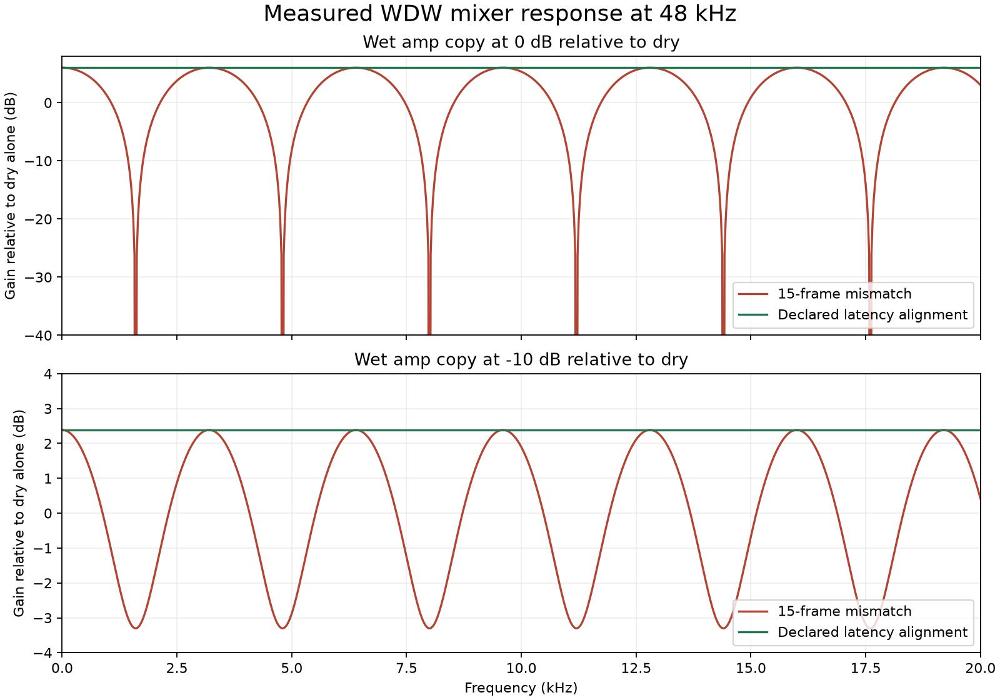

# WDW declared latency: plan and measurements

## Objective

Align the two WDW lanes using fixed processor latency in host frames. A whole-lane impulse onset measures pre-ringing or intentional effect timing; its peak also includes circuit/filter response. Neither is an authoritative alignment delay.

## Implementation plan

1. [x] Capture the pre-fix impulse onset and peak at 48 kHz, amplitude 1, threshold 1e-7, with documented parameters. Cover RAT, Big Cheese, Tape, wah, console EQ, PH-2, every hosted reverb, native-rate effects, NAM, cabinet convolution and IR reverb. Check several audio quanta and input amplitudes.
2. [x] Independently verify halfband round-trip timing and exact delayed stereo passthrough in bypass. Test dry mix endpoints separately from full effect responses.
3. [x] Expose RuntimeChain fixed latency from prepared block metadata. Zero-latency NAM/cab/IIR blocks add no scheduling delay; IR content and intentional effect delays are not compensated. WDW rejects nested split blocks, so this change does not define a new nested-routing alignment policy.
4. [x] Make WDW construction use the sum, retaining explicit latency overrides for deterministic tools. Remove preparation-time signal probing and pre-delay mutation. Update the feasibility harness to use the same declared-latency source.
5. [x] Ensure every WDW processor with fixed latency preserves it through bypass, including scalar and block processing.
6. [x] Test builder lane sums, both compensation directions, equal latency, omitted blocks, initially bypassed blocks, zero/partial/full wet mix, intentional delay/pre-delay, silent chains, reset, and common pipeline latency. Render the actual mixer and measure comb notches/ripple before and after alignment.
7. [x] Run focused regressions and relevant existing DSP/WDW/scene tests in Release and with sanitizers. Record exact commands, outcomes and limitations here.

## Baseline discovery

In the starting checkout, Daisy and console EQ allocate bypass delay storage. RAT, Big Cheese, Tape and wah do not. Their bypass timing must be corrected to make a constant chain-latency contract true. Existing working-tree changes were retained; originals of touched tracked files and the initial diff are backed up under `/tmp/ardor-wdw-latency-original`.

## Results

Measurements were made on this checkout on branch `fix/wdw-declared-latency`,
starting from commit `fb163c2a53fc7caaabe9c8943edaf2fa213d386f` plus its existing
working-tree changes (including PH-2 and console EQ). Host: x86_64, GCC 14.2.0;
Release build without fast-math; 48 kHz audio. These are host DSP sample-timing
measurements, not a new Pi deadline or analog round-trip measurement.

The baseline probe used a full-scale mono impulse, 4096 frames, a 64-frame
quantum, reset processor state, and `abs(output) >= 1e-7` in either channel.
The CSV records the JSON configuration; omitted controls use the processor's
current defaults. The initial CSV covers 47 processors. The completed suite
covers 52: all 17 modulation, 10 delay and 12 reverb catalog modes, plus RAT,
Big Cheese, Tape, console EQ, wah, NAM, cabinet, IR reverb, three dynamics
processors, parametric EQ and stereo widening.

The PR branch `fix/wdw-latency-alignment` applies only this fix to main at
`31d7665bc9da4bfd7cec3456f8492b7fc00f6034`, which includes PH-2 but not console
EQ. Its regression covers 51 processors; CMake automatically enables the 52nd
fixture and EQ-specific cases when the separate console EQ feature is built.
The recorded 52-processor measurements above retain the original checkout
configuration and do not imply that console EQ is included in this patch.

### Reproduced onset and peak

| Processor/configuration | Declared delay | Probe onset | Largest impulse sample | Bypass before → after |
| --- | ---: | ---: | ---: | ---: |
| RAT, defaults | 26 | 9 | 39 | 0 → 26 |
| Big Cheese, defaults (fuzz 0.7, tone 0.5, volume 0.7) | 26 | 5 | 26 | 0 → 26 |
| Tape, defaults, flutter/hiss off | 76 | 59 | 75 | 0 → 76 |
| Console EQ, neutral | 15 | 0 | 15 | 15 → 15 |
| Wah, position 0 | 23 | 3 | 22 | 0 → 23 |
| PH-2, catalog defaults | 15 | 0 | 15 | 15 → 15 |
| Native-rate plate, default partial mix | 0 | 0 | 0 | 0 → 0 |
| Hosted rate-adapted reverbs, default partial mix | 31 | 31 | 31 | 31 → 31 |
| NAM example LSTM | 0 | 0 | 0 | 0 → 0 |
| Cabinet with three leading zero taps | 0 | 3 | 3 | 0 → 0 |

RAT's production threshold result is **9**, and its peak is **39**. Tape's
threshold result is **59**. Big Cheese's reported **7** is reproduced with
fuzz 0.5, tone 0.5, volume 0.7 and impulse amplitudes 0.001, 0.01 or 0.1 at
threshold 1e-7. At amplitude 1 that fuzz setting starts at 6; current default
fuzz 0.7 starts at 5. The supplied production JSON/model combination was not
available, so these configurations are recorded separately instead of treating
7 as a universal onset for that circuit.

[Initial measurements](../benchmark-results/wdw-latency/before.csv),
[completed processor measurements](../benchmark-results/wdw-latency/after.csv),
[180 knob/amplitude/threshold observations](../benchmark-results/wdw-latency/parameters.csv).
The sweep varies RAT Distortion, Big Cheese Fuzz and Tape Saturation through
0, 0.25, 0.5, 0.7, 1; amplitudes through 0.001, 0.01, 0.1, 1; thresholds through
1e-10, 1e-7, 1e-4. Latency metadata stays fixed throughout.

### Wet timing and intentional delay

The neutral reverb rate adapter alone starts at **16** and peaks at **31**.
Its filter has pre-ringing, but the onset of an actual reverb includes its
musical delay. At default partial mix, the immediate amp component is delayed
31 frames, and it determines onset. With full wet mix the reverb's response
can start much later than 31 frames; whole-lane first arrival can therefore
also overestimate the intended alignment delay.

Full-wet measurements below set normalized pre-delay to zero and retain other
catalog defaults. The probe runs for 32768 frames.

| Full-wet processor | Declared fixed delay | Onset | Peak |
| --- | ---: | ---: | ---: |
| mod/phaser_ph2 | 15 | 0 | 15 |
| reverb/room | 31 | 354 | 369 |
| reverb/hall | 31 | 498 | 513 |
| reverb/plate | 0 | 304 | 4272 |
| reverb/spring | 31 | 4032 | 6952 |
| reverb/bloom | 31 | 2922 | 18835 |
| reverb/cloud | 31 | 4820 | 11697 |
| reverb/shimmer | 31 | 2738 | 4542 |
| reverb/chorale | 31 | 2750 | 4528 |
| reverb/nonlinear | 31 | 1470 | 2882 |
| reverb/swell | 31 | 2540 | 2555 |
| reverb/magneto | 31 | 5562 | 22267 |
| reverb/reflections | 31 | 686 | 701 |

[78 wet mix/pre-delay measurements](../benchmark-results/wdw-latency/wet.csv)
cover mixes 0, 0.25 and 1 and normalized pre-delay 0 and 0.15 (the pre-delay
column is unused for PH-2). A missing onset means none crossed the threshold
within the stated observation window; it does not mean an infinite latency.

The IR reverb test measures onset **24128** at 500 ms user pre-delay:
24000 intentional pre-delay frames plus 128 wet partition frames, with
**zero fixed serial latency**. The builder does not delay the amp lane by
this value or mutate the pre-delay during preparation. The full-wet digital
delay test starts at **3023** including the 26-frame lane alignment; its
musical delay remains present. Zero and partial mixes retain correctly
aligned amp copies.

### FIR timing, rate and phase

The bare resampler tests replace the circuit with a wire and use the normalized
first moment of the impulse to measure its effective DC group delay. This is
valid for the linear adapter; the nonlinear circuit impulse peak is a separate
measurement.

| Round trip | Default decimation phase: onset / peak / group delay | Primed even phase: onset / peak / group delay |
| --- | --- | --- |
| 2× | 7 / 14 / 14.5 | 0 / 15 / 15 |
| 4× | 5 / 22 / 21.75 | 7 / 22 / 22.5 |
| 8× | 9 / 25 / 25.375 | 10 / 26 / 26.25 |

PH-2 and console EQ prime the 2× decimator and match their declared 15-frame
centre. The default 4×/8× circuits select the last oversampled phase in each
host frame. Their actual adapter time origin therefore differs from simply
adding FIR centres at their operating rates. RAT/Big Cheese still declare 26,
wah 23, and Tape 76. This fix retains those declarations and verifies exact
bypass timing against them. It does **not** establish full phase equality
between active circuits: their frequency-dependent phase and these smaller
adapter phase offsets remain separate follow-up work. Tape's peak at 75 alone
cannot prove or disprove its complete fixed-delay contract.

### Rendered comb response

The test runs the real `WdwRoutingProgram` with a bypassed 15-frame PH-2 (or console EQ when available)
in the dry lane and a zero-latency wet copy. With the old zero-frame onset
estimate, the copies are 15 frames apart; with declared alignment they both
arrive at frame 15. Dry pan gains are normalized so each output has unit dry
gain, and wet gains are 1 or 10^(-10/20).

A DFT of the rendered stereo impulse measures 801 frequencies from 0 to 20 kHz
at 25 Hz spacing for each wet level. Equal-level notches at 1.6, 4.8 and
8.0 kHz are below -120 dB (limited by floating-point mixer gains). With wet
at -10 dB, the measured gain relative to dry alone ranges from **-3.3018 to
+2.3866 dB**. After alignment, the responses are flat at **+6.0206** and
**+2.3866 dB**, respectively; the remaining gain is the sum of the copies.
The linear magnitude error versus the analytic response is below 2e-6.



[1602 spectrum samples](../benchmark-results/wdw-latency/spectrum.csv).
The plot can be regenerated with `scripts/plot-wdw-latency.py` (matplotlib is
needed only for plotting, not for the C++ tests).

### Fix

`RuntimeChain::latencyFrames()` sums fixed delays captured from prepared
processors when their latency-preserving bypass rings are allocated. Alignment
and bypass consequently share the same value. Added rings for RAT, Big Cheese,
Tape and wah make that contract true in both scalar and block APIs.

The builder reads both sums, aligns the faster lane, and resets prepared state
before publication. It no longer sends impulses through production processors,
requires an audible probe signal, or temporarily edits IR pre-delay. The
internal options/report now use `deriveLatencies` / `latencyDerived`; unused
probe threshold/window fields were removed. Explicit lane-latency overrides
remain available with `deriveLatencies = false`. The feasibility harness uses
the same metadata and resets both chains before rendering. No preset schema
change is needed.

### Regression coverage

- Exact bypass impulse delay for all 52 processors at quanta 1, 16, 64, 128,
  256; scalar/block equivalence; independent stereo channels; silence after
  reset; enable changes, move and clear metadata.
- Active impulse scalar/block equivalence for all 52, and measured RAT/Tape/
  EQ/PH-2 onset and peak across all five quanta.
- Latency-aligned bypass fade against an independently rendered active
  reference, in both scalar and block APIs, for every latency-bearing effect.
- Zero, partial and full mix: metadata constant; zero mix returns the delayed
  input. Modulation cosine approximations get a small gain tolerance while
  off-impulse samples retain strict silence checks.
- Independent bare 2×/4×/8× FIR round trips: pre-ringing, DC gain, rate/phase
  timing; neutral down/up hosted-reverb boundary peak 31.
- Active builder declarations for every latency-bearing block, including
  active PH-2 whose first arrival is zero.
- Actual builder audio: dry slower, wet slower, equal latency, multiple serial
  latencies (dry 151, or 166 with console EQ; wet 77), omitted blocks, initial bypass and active dry
  mix; all five quanta; startup and reset.
- Pipeline metadata adds one common quantum and leaves relative compensation
  unchanged. Existing executor/program tests cover real worker publication.
- Two active NAM copies with bypassed RAT / dry-mix PH-2 match an independent
  NAM reference shifted 26 frames, sample by sample.
- Silent active RAT builds with declared latency; explicit overrides work;
  unaddressable delay is rejected without program publication.
- Intentional digital delay and 500 ms IR pre-delay; spectral notch/ripple
  regression on actual mixer output.

### Validation and reproduction

The pre-fix test failed at RAT bypass frame zero. A temporary build using the
original `calibrateFirstArrival` implementation against the strengthened builder
smoke also fails, even with corrected bypass code:
[onset mutation result](../benchmark-results/wdw-latency/onset-mutation.log).
These failures verify that both parts of the fix have effective regressions.

```sh
cmake -S . -B build-ci -DARDOR_UI_BACKEND=none -DCMAKE_BUILD_TYPE=Release
cmake --build build-ci -j 4
ctest --test-dir build-ci --output-on-failure -R 'pedal-(wdw-|runtime-chain|wah-processor|hosted-dsp|ph2-quality|console-eq|engine-contract|scene-transition|scene-plan)' -j 4
build-ci/pedal-rat-smoke
build-ci/pedal-cheese-smoke
build-ci/pedal-tape-smoke
build-ci/pedal-wdw-latency-regression --measure-only > after.csv
build-ci/pedal-wdw-latency-regression --measure-parameters > parameters.csv
build-ci/pedal-wdw-latency-regression --measure-wet > wet.csv
build-ci/pedal-wdw-latency-regression --measure-spectrum > spectrum.csv
```

The independent main-based PR build passes all **11 selected Release CTests**,
including the 51-processor regression with an external NAM dependency cache:
[PR Release log](../benchmark-results/wdw-latency/pr-release-test.log),
[PR measurements](../benchmark-results/wdw-latency/pr-after.csv). The same
regression also passes with console EQ enabled in the original feature checkout.

In the original feature checkout, the full Release build and standalone RAT,
Big Cheese and Tape smoke tests pass.
All **12 selected Release CTests** and **3 selected sanitizer CTests** pass.
The final selected CTest and sanitizer results are recorded in
[Release log](../benchmark-results/wdw-latency/release-test.log) and
[sanitizer log](../benchmark-results/wdw-latency/sanitizer-test.log).
AddressSanitizer and UndefinedBehaviorSanitizer use the existing `build-sanitize`
Debug configuration (`-fsanitize=address,undefined -fno-omit-frame-pointer`).
The three selected sanitizer tests cover the expanded regression, builder and
RuntimeChain. No hardware/audio device is required.

The updated [feasibility sample](../benchmark-results/wdw-latency/feasibility.csv)
runs 64/128-frame direct processing with the example LSTM and relaxed worker
requirements; lane metadata is 26/31, with no non-finite output or lane faults.
Its host timing figures are informational, not Pi admission evidence.
